# API Test Results — Modul 2

**Tester:** Ariel Itsbat Nurhaq (10231018) — Lead Frontend  
**Tanggal:** 9 Maret 2026  
**Base URL:** `http://localhost:8000`  
**Tool:** Swagger UI (`/docs`)

---

## Ringkasan Hasil Testing

| No | Endpoint | Method | Status | Result |
|----|----------|--------|--------|--------|
| 1 | `/items` | POST | 201 Created | ✅ PASS |
| 2 | `/items` | POST | 201 Created | ✅ PASS |
| 3 | `/items` | POST | 201 Created | ✅ PASS |
| 4 | `/items` | GET | 200 OK | ✅ PASS |
| 5 | `/items/1` | GET | 200 OK | ✅ PASS |
| 6 | `/items/1` | PUT | 200 OK | ✅ PASS |
| 7 | `/items/1` | GET | 200 OK | ✅ PASS |
| 8 | `/items?search=laptop` | GET | 200 OK | ✅ PASS |
| 9 | `/items/1` | DELETE | 204 No Content | ✅ PASS |
| 10 | `/items/1` | GET | 404 Not Found | ✅ PASS |
| 11 | `/items/stats` | GET | 200 OK | ✅ PASS |
| 12 | `/health` | GET | 200 OK | ✅ PASS |
| 13 | `/team` | GET | 200 OK | ✅ PASS |

**Total: 13/13 PASSED ✅**

---

## Detail Testing

### 1. POST /items — Buat Item Baru (×3)

**Request:**
```http
POST /items
Content-Type: application/json
```

**Body Item 1 (Laptop):**
```json
{"name": "Laptop", "price": 15000000, "description": "Laptop untuk cloud computing", "quantity": 5}
```

**Response (201 Created):**
```json
{
  "id": 1,
  "name": "Laptop",
  "price": 15000000.0,
  "description": "Laptop untuk cloud computing",
  "quantity": 5,
  "created_at": "2026-03-09T15:54:54.719058+07:00",
  "updated_at": null
}
```

**Screenshot:**

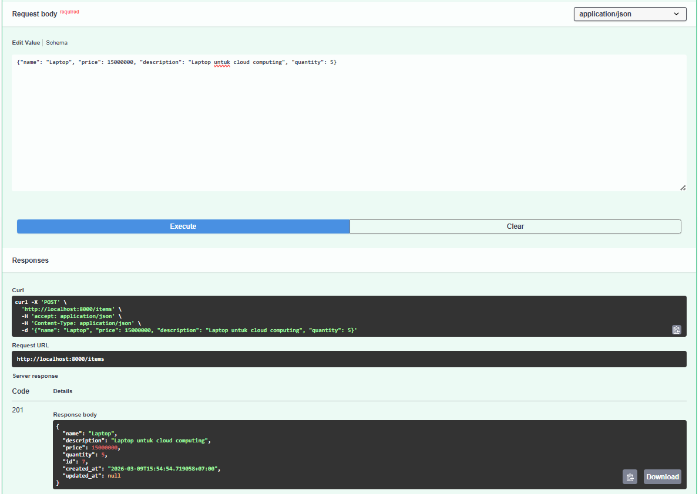

**Body Item 2 (Mouse Wireless):**
```json
{"name": "Mouse Wireless", "price": 250000, "description": "Mouse bluetooth", "quantity": 20}
```

**Response (201 Created):** ✅ id=2

**Screenshot:**

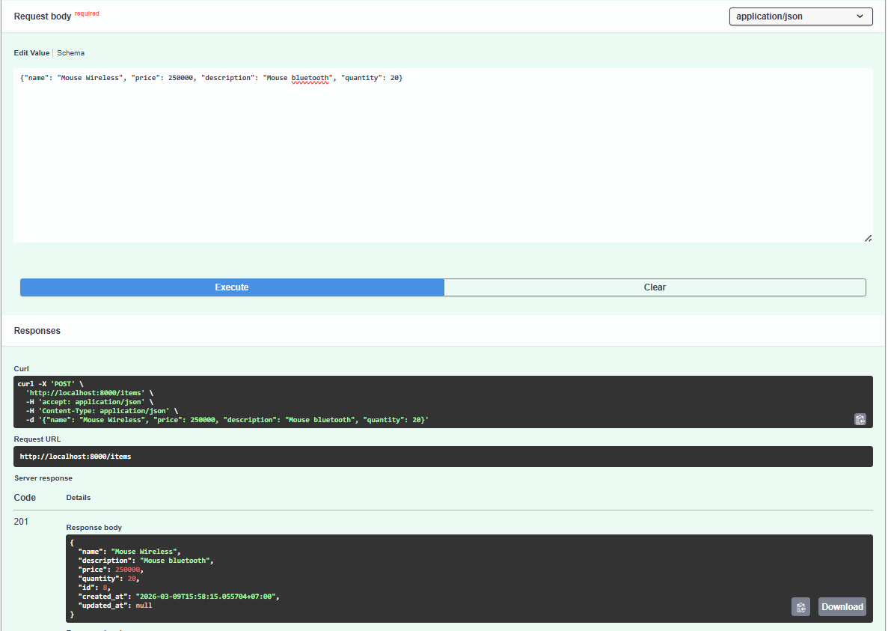

**Body Item 3 (Keyboard Mechanical):**
```json
{"name": "Keyboard Mechanical", "price": 1200000, "description": "Keyboard untuk coding", "quantity": 8}
```

**Response (201 Created):** ✅ id=3

**Screenshot:**

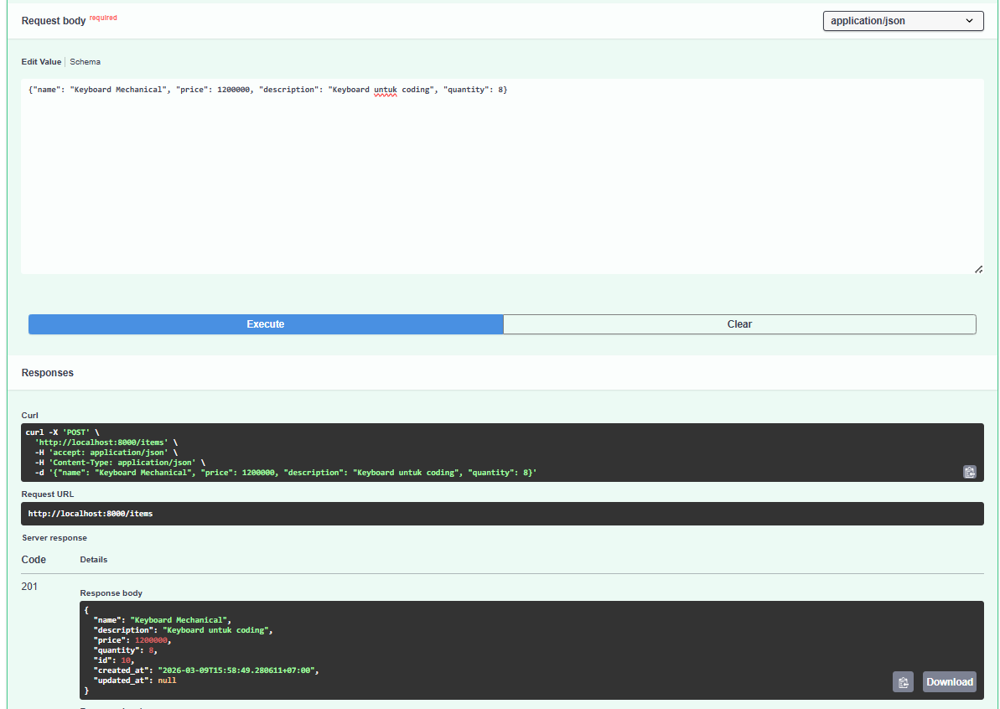

---

### 2. GET /items — List Semua Items

**Request:**
```http
GET /items
```

**Response (200 OK):**
```json
{
  "total": 3,
  "items": [
    {"id": 3, "name": "Keyboard Mechanical", "price": 1200000.0, ...},
    {"id": 2, "name": "Mouse Wireless", "price": 250000.0, ...},
    {"id": 1, "name": "Laptop", "price": 15000000.0, ...}
  ]
}
```

✅ Total = 3, semua item muncul.

**Screenshot:**

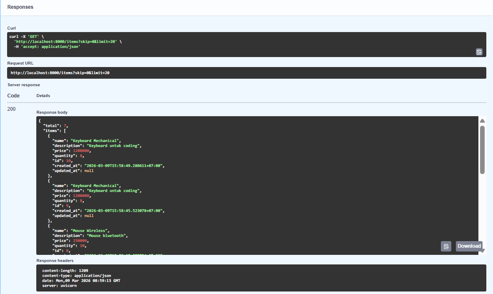

---

### 3. GET /items/1 — Ambil Item Spesifik

**Request:**
```http
GET /items/1
```

**Response (200 OK):**
```json
{
  "id": 1,
  "name": "Laptop",
  "price": 15000000.0,
  "description": "Laptop untuk cloud computing",
  "quantity": 5,
  "created_at": "2026-03-09T15:54:54.719058+07:00",
  "updated_at": null
}
```

✅ Item "Laptop" berhasil diambil.

**Screenshot:**

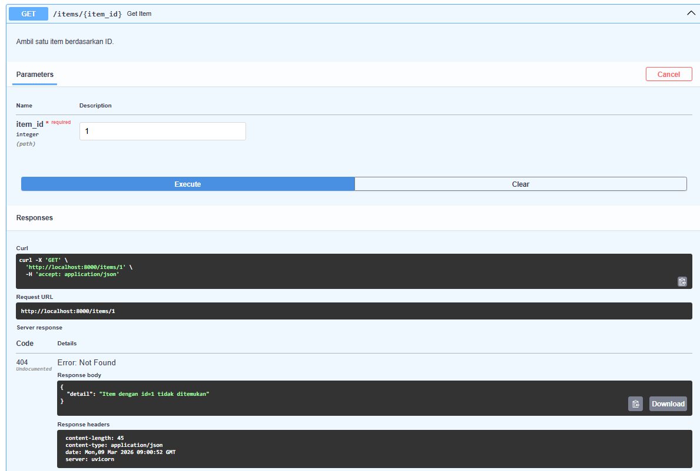

---

### 4. PUT /items/1 — Update Harga

**Request:**
```http
PUT /items/1
Content-Type: application/json

{"price": 14000000}
```

**Response (200 OK):**
```json
{
  "id": 1,
  "name": "Laptop",
  "price": 14000000.0,
  "description": "Laptop untuk cloud computing",
  "quantity": 5,
  "created_at": "2026-03-09T15:54:54.719058+07:00",
  "updated_at": "2026-03-09T16:00:00+07:00"
}
```

✅ Harga berubah dari 15000000 → 14000000. Field `updated_at` ter-update.

**Screenshot:**

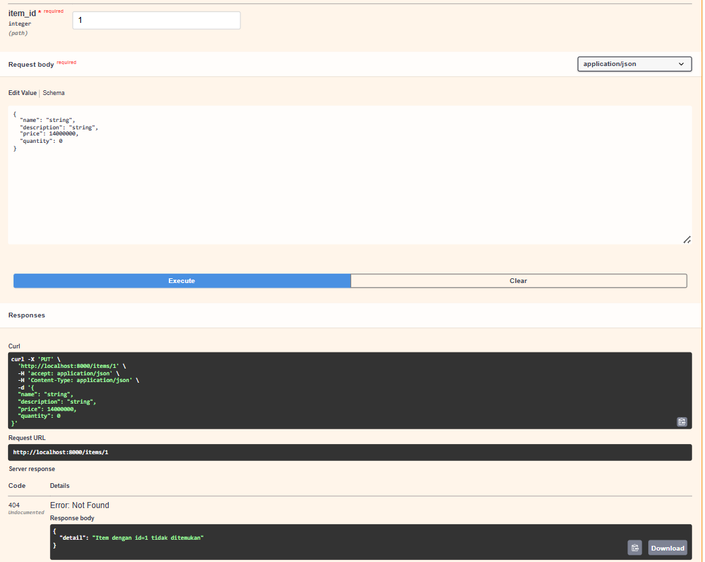

---

### 5. GET /items/1 — Verifikasi Update

**Response (200 OK):**
```json
{"price": 14000000.0}
```

✅ Harga sudah berubah dan persisten.

**Screenshot:**

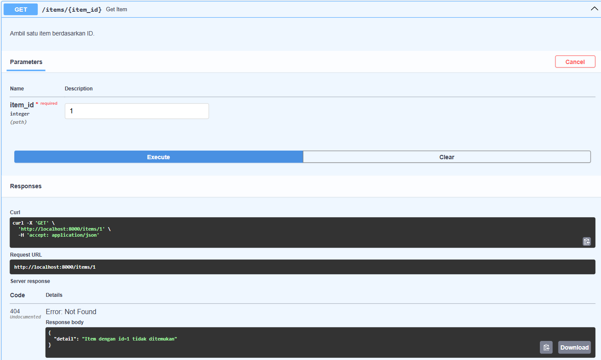

---

### 6. GET /items?search=laptop — Test Search

**Request:**
```http
GET /items?search=laptop
```

**Response (200 OK):**
```json
{
  "total": 1,
  "items": [{"id": 1, "name": "Laptop", ...}]
}
```

✅ Search berhasil, hanya 1 item cocok.

**Screenshot:**

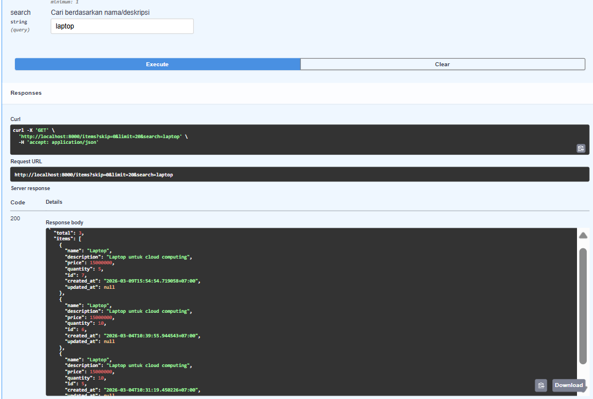

---

### 7. DELETE /items/1 — Hapus Item

**Request:**
```http
DELETE /items/1
```

**Response: 204 No Content** ✅

**Screenshot:**

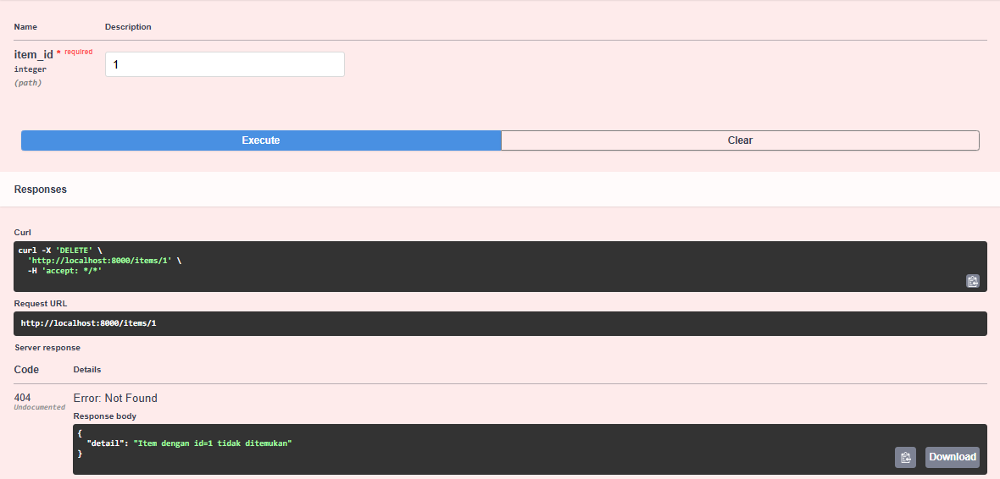

---

### 8. GET /items/1 — Verifikasi Delete (Expected 404)

**Request:**
```http
GET /items/1
```

**Response (404 Not Found):**
```json
{
  "detail": "Item dengan id=1 tidak ditemukan"
}
```

✅ Item sudah terhapus, response 404.

**Screenshot:**

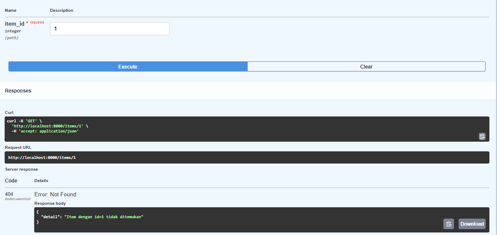

---

### 9. GET /items/stats — Statistik Inventory

**Request:**
```http
GET /items/stats
```

**Response (200 OK):**
```json
{
  "total_items": 7,
  "total_value": 40800000.0,
  "most_expensive": {
    "name": "Laptop",
    "price": 15000000.0
  },
  "cheapest": {
    "name": "Mouse Wireless",
    "price": 250000.0
  }
}
```

✅ Statistik inventory berhasil dihitung.

**Screenshot:**

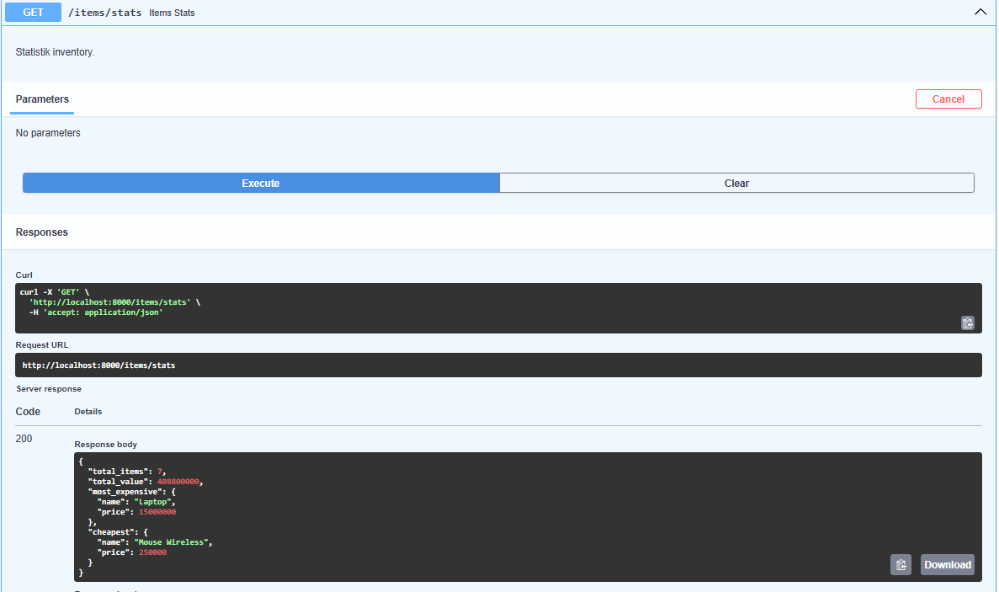

---

### 10. GET /health — Health Check

**Response (200 OK):**
```json
{"status": "healthy", "version": "0.2.0"}
```

✅ API berjalan normal.

**Screenshot:**

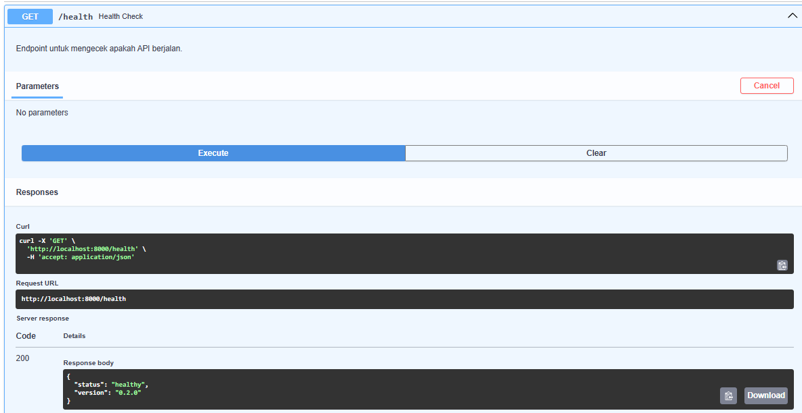

---

### 11. GET /team — Informasi Tim

**Response (200 OK):**
```json
{
  "team": "cloud-team-freepalestine",
  "project": "Dashboard Revenue Telkom Regional 4 Kalimantan",
  "members": [
    {"name": "Ariel Itsbat Nurhaq", "nim": "10231018", "role": "Lead Backend & Lead Frontend"},
    {"name": "Raditya Yudianto", "nim": "10231076", "role": "Lead QA & Docs"},
    {"name": "Muhammad Khoiruddin Marzuq", "nim": "10231065", "role": "Lead DevOps"}
  ]
}
```

✅ Data tim lengkap dan benar.

**Screenshot:**

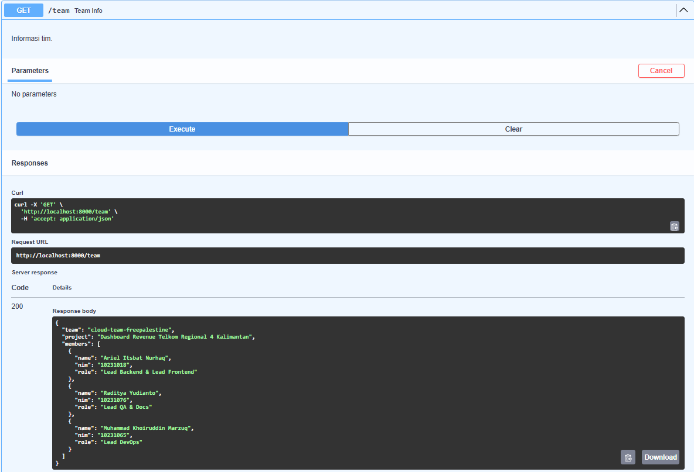

---

## Swagger UI Overview

Dokumentasi API otomatis tersedia di: `http://localhost:8000/docs`

Swagger UI menampilkan semua endpoint berikut:
- `GET /health` — Health check
- `POST /items` — Create item
- `GET /items` — List items (dengan pagination + search)
- `GET /items/stats` — Statistik inventory
- `GET /items/{item_id}` — Get item by ID
- `PUT /items/{item_id}` — Update item
- `DELETE /items/{item_id}` — Delete item
- `GET /team` — Team info

---

## Kesimpulan

Semua **13 test case PASSED** ✅. Backend REST API dengan CRUD operations berfungsi dengan baik dan terhubung ke PostgreSQL database `cloudapp`. Semua endpoint telah diverifikasi melalui Swagger UI dengan screenshot sebagai bukti.
