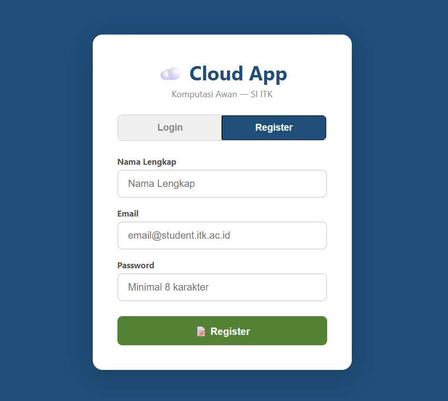
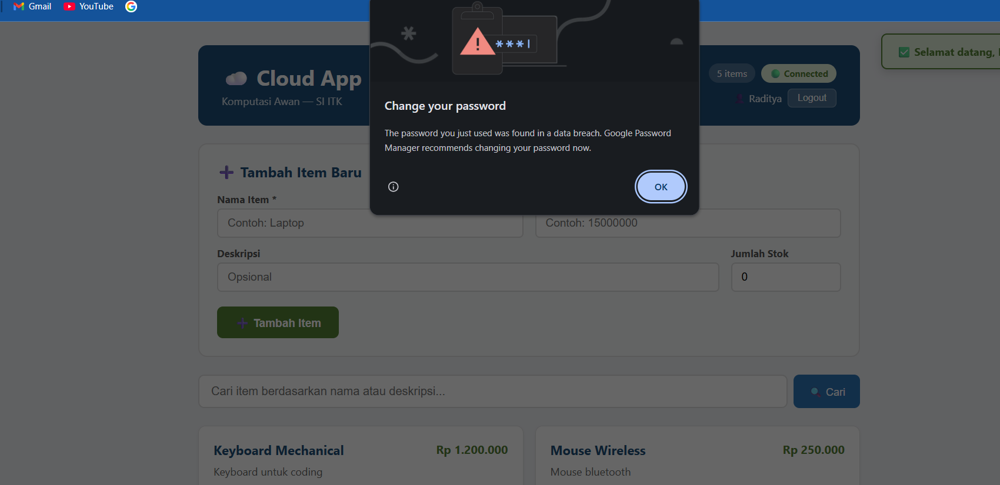
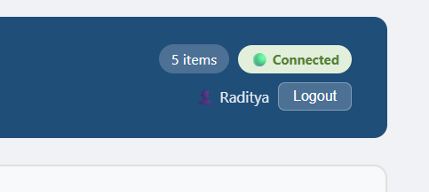
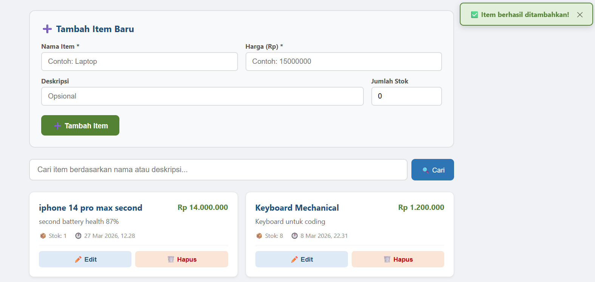
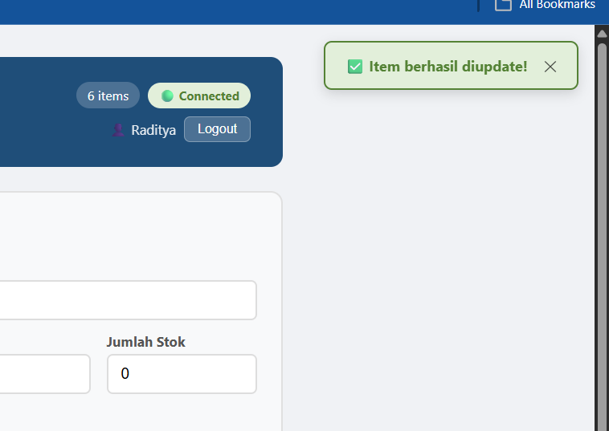
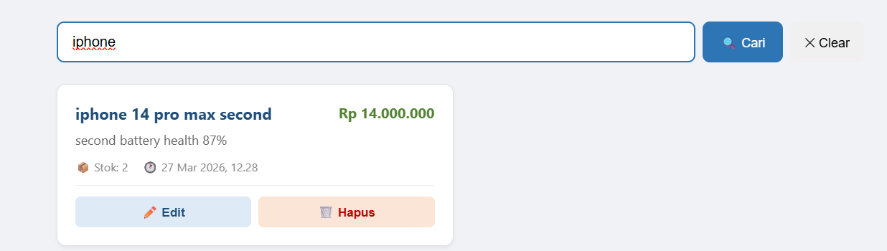
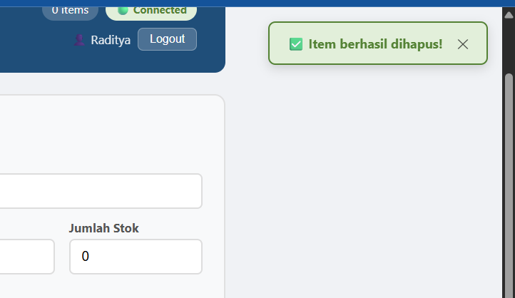
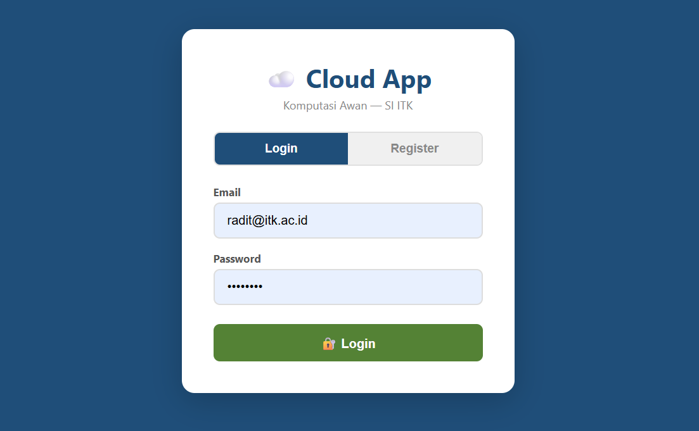
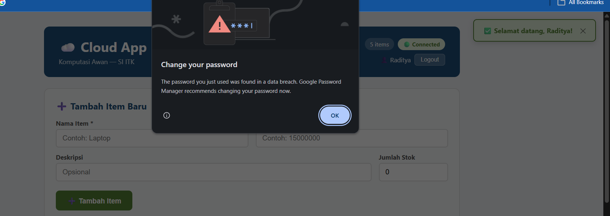
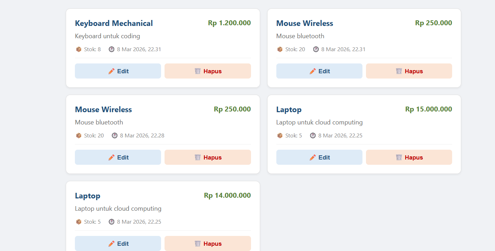

# 📋 Auth Test Results — Modul 4

**Tester:** Raditya Yudianto (Lead QA & Docs)  
**Tanggal:** 27 Maret 2026  
**URL:** http://localhost:5173  
**Status Backend:** http://localhost:8000 ✅ Running

---

## Daftar Test Case

| # | Test Case | Steps | Expected | Actual | Status | Screenshot |
|---|-----------|-------|----------|--------|--------|------------|
| 1 | Login page muncul | Buka localhost:5173 | Halaman login tampil | Halaman login tampil | ✅ Pass |  |
| 2 | Register user baru | Isi form register, klik Register | Berhasil register & otomatis login | Berhasil register & masuk app | ✅ Pass |  |
| 3 | Nama user di header | Cek header setelah login | Nama user tampil di header | Nama "Raditya" tampil di header | ✅ Pass |  |
| 4 | Tambah item (protected) | Isi form tambah item | Item baru muncul di daftar | Item berhasil ditambahkan | ✅ Pass |  |
| 5 | Edit item (protected) | Klik edit, ubah data, submit | Data item berubah | Data item berhasil diupdate | ✅ Pass |  |
| 6 | Search item | Ketik keyword di SearchBar | Hasil filter muncul | Hasil pencarian tampil | ✅ Pass |  |
| 7 | Hapus item (protected) | Klik hapus, konfirmasi | Item hilang dari daftar | Item terhapus | ✅ Pass |  |
| 8 | Logout | Klik tombol Logout | Kembali ke halaman login | Redirect ke halaman login | ✅ Pass |  |
| 9 | Login kembali | Isi email & password lama | Berhasil masuk app | Berhasil login | ✅ Pass |  |
| 10 | Data persists | Cek daftar item setelah login ulang | Data masih ada | Data items masih tersimpan | ✅ Pass |  |

---

## Hasil Keseluruhan

- **Total Test:** 10
- **Pass:** 10
- **Fail:** 0
- **Kesimpulan:** Alur auth (register → login → CRUD → logout) berjalan sempurna end-to-end.
