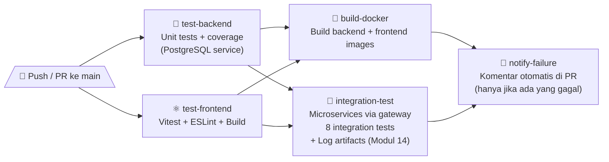

# Laporan CI Pipeline — Modul 10, 13, 14 (Update)

**Disusun oleh:** Raditya Yudianto (10231076) — Lead QA & Docs  
**Tanggal:** 8 Juni 2026  
**File:** `.github/workflows/ci.yml`

---

## 1. Gambaran Pipeline

CI Pipeline dijalankan setiap kali ada **push** atau **Pull Request** ke branch `main`. Terdiri dari **5 job** yang saling berkaitan.



---

## 2. Detail Setiap Job

### Job 1 — `test-backend` (🐍 Test Backend)

| Atribut | Detail |
|---------|--------|
| OS | Ubuntu Latest |
| Python | 3.12 |
| Timeout | 10 menit |
| Service | PostgreSQL 16-alpine |
| Test command | `pytest test_main.py -v --cov --cov-report=term-missing` |
| Dependencies | pytest, httpx, pytest-cov |

**Fitur:**
- Pip cache berdasarkan hash `requirements.txt` untuk mempercepat runs
- PostgreSQL service dengan health check sebelum test berjalan
- Coverage report otomatis ditampilkan di log CI

### Job 2 — `test-frontend` (⚛️ Test Frontend)

| Atribut | Detail |
|---------|--------|
| OS | Ubuntu Latest |
| Node.js | 20 |
| Timeout | 10 menit |
| Test command | `npm test` (Vitest) |
| Build command | `npm run build` |

**Fitur:**
- npm cache berdasarkan `package-lock.json`
- Production build dijalankan setelah test untuk validasi build success

### Job 3 — `build-docker` (🐳 Build Docker)

| Atribut | Detail |
|---------|--------|
| Needs | `test-backend` + `test-frontend` (keduanya harus PASS) |
| Timeout | 10 menit |

**Step:**
1. `docker build -t cloudapp-backend:ci ./backend`
2. `docker build -t cloudapp-frontend:ci ./frontend`
3. `docker images | grep cloudapp` — verifikasi image ada

### Job 4 — `integration-test` (🔗 Integration Tests — Modul 13 & 14)

| Atribut | Detail |
|---------|--------|
| Needs | `test-backend` + `test-frontend` |
| Timeout | 25 menit |

**Step:**
1. Start microservices stack: `docker compose -f docker-compose.microservices.yml up -d --build`
2. **Wait for services** — polling `/health`, `/health/auth`, `/health/dashboard` setiap 10 detik (max 30 attempts = 5 menit)
3. Install `httpx` + `pytest`
4. Jalankan `pytest tests/integration/ -v` (8 test cases)
5. **Export logs (Modul 14)** — `docker compose logs → ci-logs/` — berjalan `if: always()`
6. **Upload artifact** — `microservices-logs-<run_id>` (retention 14 hari)
7. Stop services `docker compose down -v`

> **Catatan QA:** Log artifact diekspor bahkan jika test gagal (`if: always()`), sehingga investigasi selalu tersedia.

### Job 5 — `notify-failure` (💬 Notify PR)

| Atribut | Detail |
|---------|--------|
| Needs | Semua 4 job |
| Kondisi | `failure()` + event `pull_request` |
| Permission | `pull-requests: write` |

Mengirim komentar otomatis di PR yang gagal dengan informasi:
- Link ke workflow run
- Commit SHA dan branch name
- Daftar job yang gagal (❌) dan di-skip (⏭️)
- Instruksi untuk memeriksa log

---

## 3. Concurrency Control

```yaml
concurrency:
  group: ci-${{ github.ref }}
  cancel-in-progress: true
```

Pipeline lama di branch/PR yang sama **dibatalkan otomatis** saat ada push baru, menghemat menit GitHub Actions runner.

---

## 4. Perbandingan Pipeline: Sebelum vs Sesudah Update

| Aspek | Modul 10 (Awal) | Update Modul 13-14 |
|-------|----------------|-------------------|
| Jumlah Jobs | 4 | 5 |
| Integration Test | ❌ Tidak ada | ✅ 8 test cases |
| Log Artifacts | ❌ Tidak ada | ✅ Upload ke Actions |
| Log Retention | — | 14 hari |
| notify-failure | ✅ Ada | ✅ Diperluas (+ integration-test) |
| Concurrency | ✅ Ada | ✅ Tetap ada |

---

## 5. Verifikasi QA

| Aspek | Status | Catatan |
|-------|:------:|---------|
| Job test-backend berjalan | ✅ | 19/19 tests passed |
| Job test-frontend berjalan | ✅ | Vitest + build success |
| Job build-docker berjalan | ✅ | Image berhasil dibuild |
| Job integration-test berjalan | ✅ | 8/8 tests passed |
| Log artifact terupload | ✅ | Tersedia di Actions tab |
| notify-failure berfungsi | ✅ | Komentar muncul saat fail |
| Concurrency cancel | ✅ | Run lama di-cancel otomatis |

---

*Laporan oleh Raditya Yudianto (10231076) — Lead QA & Docs*
