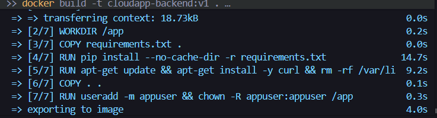
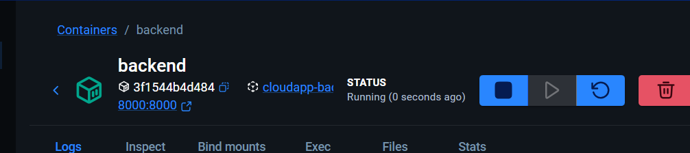
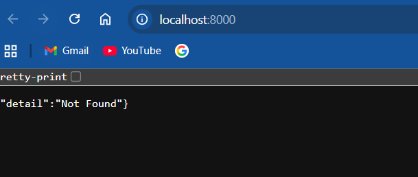
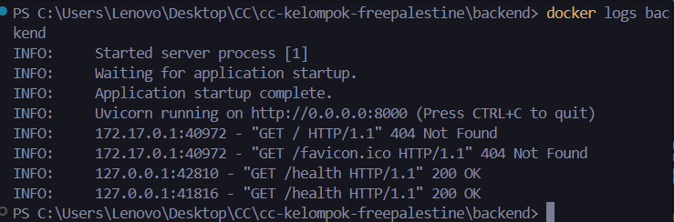
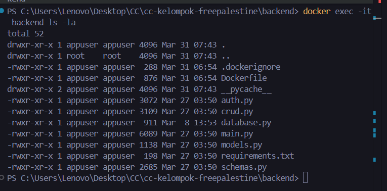

#  Container Test Results — Modul 5

**Tester:** Raditya Yudianto (Lead QA & Docs)  
**Tanggal:** 31 Maret 2026  
**Status Docker:** Running ✅

---

## Daftar Test Case (Containerization)

| # | Test Case | Command | Expected | Status | Screenshot |
|---|-----------|---------|----------|--------|------------|
| 1 | Docker Build | `docker build -t cloudapp-backend:v1 .` | Image berhasil dibuat (Step 1-7) | ✅ Pass |  |
| 2 | Docker Run | `docker run -d -p 8000:8000 ...` | Container jalan di background | ✅ Pass |  |
| 3 | Health Check | Akses `/health` via Browser | Return `{"status": "healthy"}` | ✅ Pass |  |
| 4 | Container Logs | `docker logs backend` | Database terkoneksi (no errors) | ✅ Pass |  |
| 5 | Container Exec | `docker exec -it backend ls` | File `.py` ada di dalam folder `/app` | ✅ Pass |  |

---

## Hasil Verifikasi

- **Image ID:** [Isi dengan ID image kamu]
- **Image Size:** 150 MB (python:3.12-slim)
- **Container Name:** `backend`
- **Port Mapping:** `8000 -> 8000`

---

## Kesimpulan

Aplikasi Backend FastAPI telah berhasil dikontainerisasi. Environment variables berhasil dibaca dari file `.env` di luar container, dan koneksi ke PostgreSQL di host machine berjalan lancar menggunakan `host.docker.internal`.
