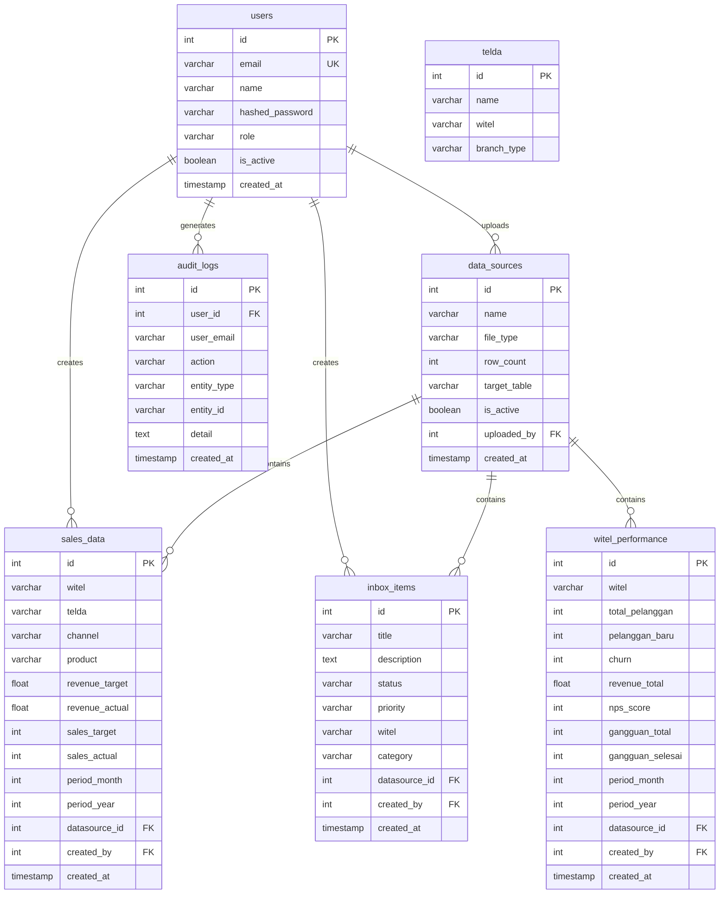

# Database Schema — Dashboard Telkom TREG 4 Kalimantan

> Dokumen ini menjelaskan struktur database PostgreSQL yang digunakan oleh backend FastAPI.

## Entity Relationship Diagram

## Tabel Detail

### 1. `users`
Menyimpan data autentikasi dan otorisasi.

| Kolom | Tipe | Constraint | Keterangan |
|-------|------|-----------|------------|
| id | INTEGER | PK, AUTO | |
| email | VARCHAR(255) | UNIQUE, NOT NULL | Login identifier |
| name | VARCHAR(100) | NOT NULL | Display name |
| hashed_password | VARCHAR(255) | NOT NULL | bcrypt hash |
| role | VARCHAR(20) | NOT NULL, DEFAULT 'viewer' | admin / viewer |
| is_active | BOOLEAN | DEFAULT true | Soft-delete flag |
| created_at | TIMESTAMPTZ | DEFAULT now() | |

### 2. `sales_data`
Data penjualan & revenue per Witel/Telda.

| Kolom | Tipe | Constraint | Keterangan |
|-------|------|-----------|------------|
| id | INTEGER | PK, AUTO | |
| witel | VARCHAR(50) | NOT NULL, INDEX | Wilayah Telekomunikasi |
| telda | VARCHAR(100) | INDEX | Telkom Daerah |
| channel | VARCHAR(50) | NOT NULL | Channel penjualan |
| product | VARCHAR(50) | NOT NULL, DEFAULT 'HSI' | Produk (HSI, IPTV, dll) |
| revenue_target | FLOAT | NOT NULL | Target revenue (juta) |
| revenue_actual | FLOAT | NOT NULL | Realisasi revenue (juta) |
| sales_target | INTEGER | NOT NULL | Target SSL |
| sales_actual | INTEGER | NOT NULL | Realisasi SSL |
| period_month | INTEGER | NOT NULL | Bulan (1-12) |
| period_year | INTEGER | NOT NULL | Tahun |
| datasource_id | INTEGER | FK → data_sources | File sumber |
| created_by | INTEGER | FK → users | User yang upload |

### 3. `inbox_items`
Tiket gangguan & customer care.

| Kolom | Tipe | Constraint | Keterangan |
|-------|------|-----------|------------|
| id | INTEGER | PK, AUTO | |
| title | VARCHAR(200) | NOT NULL | Judul tiket |
| description | TEXT | | Detail masalah |
| status | VARCHAR(30) | NOT NULL, DEFAULT 'pending' | pending/in_progress/completed/rejected |
| priority | VARCHAR(20) | NOT NULL, DEFAULT 'medium' | low/medium/high/critical |
| witel | VARCHAR(50) | NOT NULL | Wilayah |
| category | VARCHAR(50) | | network/billing/service |
| datasource_id | INTEGER | FK → data_sources | File sumber |
| created_by | INTEGER | FK → users | |

### 4. `data_sources`
Tracking file yang di-upload user.

| Kolom | Tipe | Constraint | Keterangan |
|-------|------|-----------|------------|
| id | INTEGER | PK, AUTO | |
| name | VARCHAR(200) | NOT NULL | Nama file asli |
| file_type | VARCHAR(10) | NOT NULL | csv / xlsx |
| row_count | INTEGER | NOT NULL | Jumlah baris valid |
| target_table | VARCHAR(30) | NOT NULL | sales / inbox / witel |
| is_active | BOOLEAN | DEFAULT true | Toggle tampil/tidak |
| uploaded_by | INTEGER | FK → users | |
| created_at | TIMESTAMPTZ | DEFAULT now() | |

### 5. `witel_performance`
Data performa Witel untuk Leaderboard.

| Kolom | Tipe | Constraint | Keterangan |
|-------|------|-----------|------------|
| id | INTEGER | PK, AUTO | |
| witel | VARCHAR(50) | NOT NULL, INDEX | Nama Witel |
| total_pelanggan | INTEGER | NOT NULL | Jumlah pelanggan |
| pelanggan_baru | INTEGER | NOT NULL | Pelanggan baru bulan ini |
| churn | INTEGER | NOT NULL | Pelanggan lepas |
| revenue_total | FLOAT | NOT NULL | Total revenue |
| nps_score | INTEGER | NOT NULL | Net Promoter Score |
| gangguan_total | INTEGER | NOT NULL | Total gangguan |
| gangguan_selesai | INTEGER | NOT NULL | Gangguan terselesaikan |
| period_month | INTEGER | NOT NULL | Bulan |
| period_year | INTEGER | NOT NULL | Tahun |
| datasource_id | INTEGER | FK → data_sources | |

### 6. `audit_logs`
Riwayat aktivitas user untuk compliance.

| Kolom | Tipe | Constraint | Keterangan |
|-------|------|-----------|------------|
| id | INTEGER | PK, AUTO | |
| user_id | INTEGER | FK → users | |
| user_email | VARCHAR(255) | | Snapshot email |
| action | VARCHAR(50) | NOT NULL, INDEX | login/upload_sales/create_user/dll |
| entity_type | VARCHAR(50) | | user/file/sales |
| entity_id | VARCHAR(100) | | ID entitas terkait |
| detail | TEXT | | Keterangan tambahan |
| created_at | TIMESTAMPTZ | DEFAULT now(), INDEX | |

### 7. `telda`
Master data Telkom Daerah per Witel.

| Kolom | Tipe | Constraint | Keterangan |
|-------|------|-----------|------------|
| id | INTEGER | PK, AUTO | |
| name | VARCHAR(100) | NOT NULL | Nama Telda |
| witel | VARCHAR(50) | NOT NULL, INDEX | Parent Witel |
| branch_type | VARCHAR(20) | NOT NULL | Inner/Type-1/Type-2 |

---

*Generated from `backend/models.py` — Ariel Itsbat Nurhaq*
