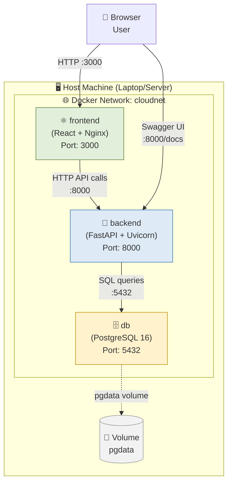

# Dokumentasi Arsitektur Docker — Modul 6

**Lead QA & Docs:** Raditya Yudianto (10231076)  
**Tanggal:** 17 Mei 2026

---

## Gambaran Umum

Aplikasi Dashboard Telkom Regional 4 Kalimantan dijalankan menggunakan 3 container Docker yang saling terhubung dalam satu Docker network. Setiap container memiliki fungsi spesifik dan berkomunikasi melalui jaringan internal Docker.

---

## Diagram Arsitektur 3-Container



---

## Port Mapping

| Container | Image | Port Internal | Port Host | Akses |
|-----------|-------|---------------|-----------|-------|
| `frontend` | `cloudapp-frontend:v1` | 3000 | 3000 | http://localhost:3000 |
| `backend` | `cloudapp-backend:v2` | 8000 | 8000 | http://localhost:8000 |
| `db` | `postgres:16-alpine` | 5432 | 5432 | localhost:5432 (internal) |

---

## Docker Network

| Nama Network | Driver | Scope | Deskripsi |
|--------------|--------|-------|-----------|
| `cloudnet` | bridge | local | Jaringan internal yang menghubungkan semua container |

**Cara membuat network:**
```bash
docker network create cloudnet
```

**Verifikasi network:**
```bash
docker network inspect cloudnet
```

Semua container dalam network `cloudnet` bisa saling berkomunikasi menggunakan **nama container sebagai hostname** (container-to-container DNS). Contoh: backend memanggil database menggunakan host `db:5432`, bukan `localhost:5432`.

---

## Docker Volumes

| Nama Volume | Container | Mount Point | Deskripsi |
|-------------|-----------|-------------|-----------|
| `pgdata` | `db` | `/var/lib/postgresql/data` | Persistensi data PostgreSQL |

**Keuntungan volume:**
- Data tidak hilang saat container di-restart atau di-remove
- Dapat di-backup dan di-restore
- Performa lebih baik dibanding bind mount

**Perintah terkait:**
```bash
# Lihat semua volume
docker volume ls

# Inspect volume
docker volume inspect pgdata

# Backup volume
docker run --rm -v pgdata:/data -v $(pwd):/backup alpine tar czf /backup/pgdata-backup.tar.gz /data
```

---

## Environment Variables per Container

### Container: `backend`

| Variable | Value | Deskripsi |
|----------|-------|-----------|
| `DATABASE_URL` | `postgresql://postgres:postgres123@db:5432/cloudapp` | Koneksi ke PostgreSQL |
| `SECRET_KEY` | `your-secret-key-here` | JWT signing key |
| `ALGORITHM` | `HS256` | Algoritma JWT |
| `ACCESS_TOKEN_EXPIRE_MINUTES` | `60` | Durasi token |
| `ALLOWED_ORIGINS` | `http://localhost:3000` | CORS whitelist |

### Container: `db`

| Variable | Value | Deskripsi |
|----------|-------|-----------|
| `POSTGRES_USER` | `postgres` | Username database |
| `POSTGRES_PASSWORD` | `postgres123` | Password database |
| `POSTGRES_DB` | `cloudapp` | Nama database |

### Container: `frontend`

| Variable | Value | Deskripsi |
|----------|-------|-----------|
| `VITE_API_URL` | `http://localhost:8000` | URL backend API |

---

## Dockerfile Multi-Stage Build (Backend)

Backend menggunakan **multi-stage build** untuk mengoptimalkan ukuran image:

```dockerfile
# Stage 1: Builder
FROM python:3.12-slim AS builder
WORKDIR /app
COPY requirements.txt .
RUN pip install --no-cache-dir -r requirements.txt

# Stage 2: Runtime (image lebih kecil)
FROM python:3.12-slim
WORKDIR /app
COPY --from=builder /usr/local/lib/python3.12/site-packages /usr/local/lib/python3.12/site-packages
COPY . .
EXPOSE 8000
CMD ["uvicorn", "main:app", "--host", "0.0.0.0", "--port", "8000"]
```

**Perbandingan ukuran image:**

| Stage | Ukuran | Deskripsi |
|-------|--------|-----------|
| Base (`python:3.12`) | ~1.01 GB | Image standar |
| Single-stage build | ~350 MB | Hanya copy requirements |
| Multi-stage build | ~250 MB | Optimasi (tanpa build tools) |

---

## Cara Menjalankan Manual (Step by Step)

```bash
# 1. Buat network
docker network create cloudnet

# 2. Jalankan database
docker run -d \
  --name db \
  --network cloudnet \
  -e POSTGRES_USER=postgres \
  -e POSTGRES_PASSWORD=postgres123 \
  -e POSTGRES_DB=cloudapp \
  -p 5432:5432 \
  -v pgdata:/var/lib/postgresql/data \
  postgres:16-alpine

# 3. Tunggu database siap
docker exec db pg_isready -U postgres

# 4. Build & jalankan backend
cd backend
docker build -t cloudapp-backend:v2 .
docker run -d \
  --name backend \
  --network cloudnet \
  -e DATABASE_URL=postgresql://postgres:postgres123@db:5432/cloudapp \
  -e SECRET_KEY=your-secret-key-here \
  -p 8000:8000 \
  cloudapp-backend:v2

# 5. Build & jalankan frontend
cd ../frontend
docker build -t cloudapp-frontend:v1 .
docker run -d \
  --name frontend \
  --network cloudnet \
  -p 3000:3000 \
  cloudapp-frontend:v1

# 6. Verifikasi semua container running
docker ps
docker network inspect cloudnet
```

---

## Cara Menjalankan dengan Docker Compose (Cara Mudah)

```bash
# Jalankan semua container sekaligus
docker compose up --build -d

# Cek status
docker compose ps

# Lihat logs
docker compose logs -f

# Stop semua
docker compose down
```

---

## Verifikasi Health Container

```bash
# Cek backend health
curl http://localhost:8000/health
# Expected: {"status": "healthy", "service": "backend"}

# Cek database connection
docker exec db psql -U postgres -d cloudapp -c "\dt"
# Expected: List of relations (tabel yang sudah dibuat)

# Cek frontend
curl -I http://localhost:3000
# Expected: HTTP/1.1 200 OK
```

---

*Dokumen dibuat oleh Raditya Yudianto (10231076) — Lead QA & Docs*
