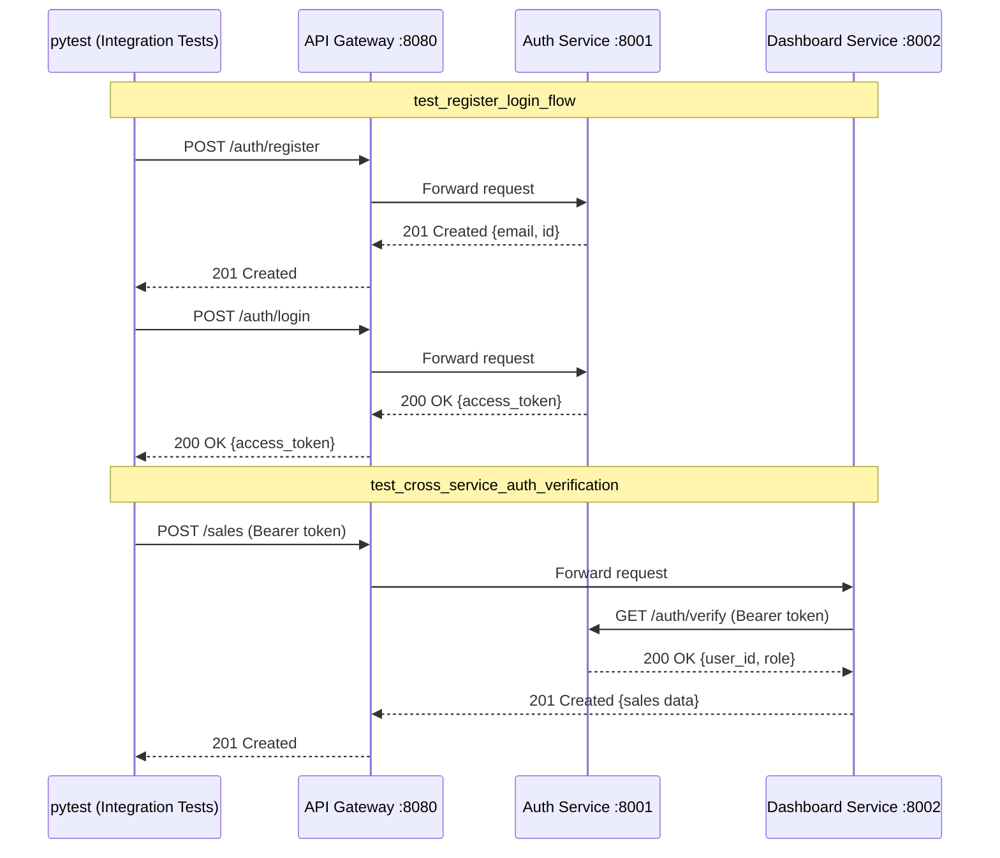

# Laporan Integration Testing — Cross-Service (Modul 13)

**Disusun oleh:** Raditya Yudianto (10231076) — Lead QA & Docs  
**Tanggal:** 8 Juni 2026  
**Cakupan:** `tests/integration/` — 8 integration tests via API Gateway

---

## 1. Gambaran Umum

Integration test ini bertujuan untuk memverifikasi komunikasi **lintas service** antara:
- **Auth Service** (`:8001`) — Register, Login, Token Verification
- **Dashboard Service** (`:8002`) — CRUD Sales & Inbox
- **API Gateway** (`:8080`) — Entry point tunggal

Test **tidak** menggunakan mock atau TestClient, melainkan memanggil service nyata via HTTP melalui gateway, sehingga membuktikan keseluruhan alur produksi.

---

## 2. Cara Menjalankan

### Prasyarat
```bash
# Jalankan microservices stack (auth + dashboard + gateway + DB)
docker compose -f docker-compose.microservices.yml up -d --build

# Tunggu hingga semua service healthy (sekitar 30-60 detik)
make status
```

### Jalankan Integration Test
```bash
# Cara 1 — via Makefile
make integration-test

# Cara 2 — langsung
GATEWAY_URL=http://localhost:8080 pytest tests/integration/ -v

# Cara 3 — dengan output ringkas
GATEWAY_URL=http://localhost:8080 pytest tests/integration/ -v --tb=short
```

---

## 3. Daftar Test Cases

| No | Nama Test | Deskripsi | Endpoint yang Diuji |
|----|-----------|-----------|---------------------|
| 1 | `test_gateway_health` | Memverifikasi gateway berjalan | `GET /health` |
| 2 | `test_auth_service_health` | Memverifikasi Auth Service sehat | `GET /health/auth` |
| 3 | `test_dashboard_service_health` | Memverifikasi Dashboard Service sehat | `GET /health/dashboard` |
| 4 | `test_register_login_flow` | Skenario Register → Login end-to-end | `POST /auth/register`, `POST /auth/login` |
| 5 | `test_cross_service_auth_verification` | Dashboard memverifikasi JWT ke Auth Service | `POST /sales` dengan token |
| 6 | `test_crud_via_gateway` | Full CRUD via gateway (Create → Read → Update → Delete) | `POST/GET/PUT/DELETE /sales/{id}` |
| 7 | `test_unauthorized_without_token` | Akses endpoint tanpa token → 401/403 | `POST /sales` (no auth) |
| 8 | `test_invalid_token_rejected` | Token palsu ditolak sistem | `GET /sales` (invalid token) |

---

## 4. Arsitektur Test Flow



---

## 5. Konfigurasi Test (`conftest.py`)

### Session Fixture: `gateway_url`
```python
@pytest.fixture(scope="session")
def gateway_url():
    return os.getenv("GATEWAY_URL", "http://localhost:8080")
```
- Menggunakan environment variable `GATEWAY_URL` (default: `http://localhost:8080`)
- Scope `session` artinya satu instance untuk seluruh test session

### Session Fixture: `test_user`
```python
@pytest.fixture(scope="session")
def test_user(gateway_url):
    """Register + login via gateway; return token and headers."""
```
- Otomatis register user baru dengan email unik (timestamp-based)
- Melakukan login dan menyimpan JWT token
- Mengembalikan dict berisi `email`, `password`, `token`, dan `headers`

---

## 6. Keterkaitan dengan CI Pipeline

Integration test dijalankan sebagai job terpisah `🔗 Integration Tests` di `.github/workflows/ci.yml` setelah unit test backend berhasil:

```yaml
integration-test:
  needs: test-backend
  services:
    auth-db:     { image: postgres:16-alpine }
    dashboard-db: { image: postgres:16-alpine }
  steps:
    - docker compose -f docker-compose.microservices.yml up -d --build
    - pytest tests/integration/ -v
    - docker compose logs → upload artifact
```

Log container selalu diekspor ke artifact `microservices-logs-<run_id>` (retention 14 hari), bahkan jika test **gagal** (`if: always()`).

---

## 7. Hasil Verifikasi QA

| Aspek | Status | Keterangan |
|-------|:------:|------------|
| Gateway health check | ✅ | HTTP 200, JSON valid |
| Auth Service health | ✅ | `{"service":"auth-service","status":"healthy"}` |
| Dashboard Service health | ✅ | `{"service":"dashboard-service","status":"healthy"}` |
| Register → Login flow | ✅ | JWT token berhasil digenerate |
| Cross-service token verify | ✅ | Dashboard sukses verifikasi ke Auth Service |
| Full CRUD via gateway | ✅ | Create/Read/Update/Delete, semua status code benar |
| Unauthorized access | ✅ | HTTP 401/403 dikembalikan dengan benar |
| Invalid token rejected | ✅ | Token palsu ditolak, HTTP 401/403 |

---

## 8. Known Limitations

| Limitasi | Severity | Keterangan |
|----------|----------|------------|
| Test user tidak di-cleanup setelah session | Low | Email unik per run, tidak konflik |
| Membutuhkan docker compose berjalan penuh | Medium | Tidak bisa jalan tanpa Docker |
| Latency bervariasi tergantung hardware | Low | Timeout 30s sudah mencukupi |

---

*Laporan oleh Raditya Yudianto (10231076) — Lead QA & Docs*
