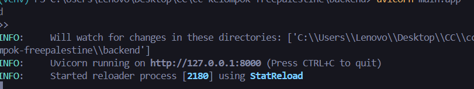
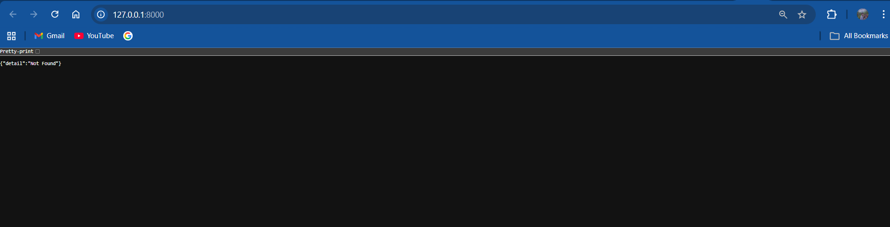
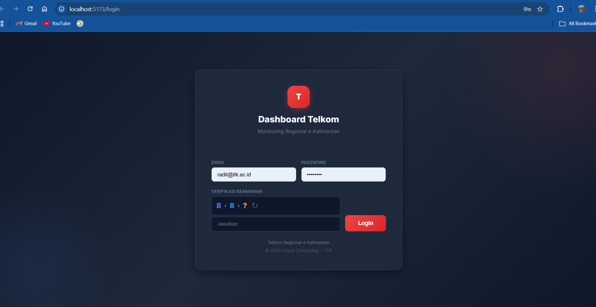

# Modul 1: Setup Lingkungan Kerja & Hello World

## 📌 Tujuan
Modul ini mendokumentasikan proses inisiasi proyek, setup environment (lingkungan pengembangan), dan pembuatan aplikasi "Hello World" menggunakan framework **FastAPI** (Backend) dan **React+Vite** (Frontend) untuk proyek Dashboard Revenue Telkom.

## 🛠️ Persiapan Tools (Prasyarat)
Sebelum memulai pengembangan, beberapa *tools* telah diinstal pada perangkat para pengembang:
1. **Python 3.12** - Digunakan sebagai versi utama untuk backend FastAPI.
2. **Node.js (versi 18+)** - Diperlukan untuk package manager Frontend (npm/React).
3. **Git & GitHub** - Version control system untuk kolaborasi tim.
4. **Visual Studio Code (VS Code)** - Code editor utama.

## 📁 Struktur Dasar Proyek
Kami menggunakan struktur repositori *monorepo*, di mana backend dan frontend dipisah di dua folder utama dalam satu repository:

```text
cc-kelompok-freepalestine/
├── backend/          # Berisi seluruh kode FastAPI (Python)
├── frontend/         # Berisi seluruh kode UI React Vite (JS)
├── docs/             # Dokumentasi proyek & laporan tiap modul
├── docker-compose.yml# Orkestrasi Docker (Modul lanjutan)
└── README.md         # Halaman muka proyek
```

## 🚀 Eksekusi & Bukti Jalan (Hello World)

### A. Backend (FastAPI) - Setup & Run
Pada sisi backend, pengembangan diawali dengan pembuatan virtual environment dan insiasi FastAPI sederhana.

**Langkah Instalasi:**
```bash
# 1. Masuk ke folder backend
cd backend

# 2. Buat virtual environment agar dependensi Python terisolasi
python -m venv venv

# 3. Aktifkan virtual environment (Windows)
.\venv\Scripts\activate

# 4. Install FastAPI dan Uvicorn (Server)
pip install fastapi "uvicorn[standard]"
```

**Verifikasi "Hello World" / Health Check:**
Aplikasi FastAPI dijalankan di local server:
```bash
uvicorn main:app --reload --port 8000
```

| Terminal Output | Browser Output |
| :---: | :---: |
|  |  |

Saat diakses melalui `http://localhost:8000/health`, server berhasil merespons dengan JSON status: `{"status": "ok", "message": "API Dashboard Telkom berjalan dengan baik"}`.

### B. Frontend (React + Vite) - Setup & Run
Pada sisi frontend, proyek diinisialisasi menggunakan *Vite* agar waktu build sangat cepat.

**Langkah Instalasi:**
```bash
# 1. Masuk ke folder frontend (jika baru membuat: npm create vite@latest frontend -- --template react)
cd frontend

# 2. Install package / dependencies
npm install

# 3. Jalankan development server lokal
npm run dev
```

**Verifikasi "Hello World":**
Aplikasi React berjalan di port default Vite `http://localhost:5173/`. Halaman berhasil merender komponen utama proyek.

| Tampilan Frontend |
| :---: |
|  |
