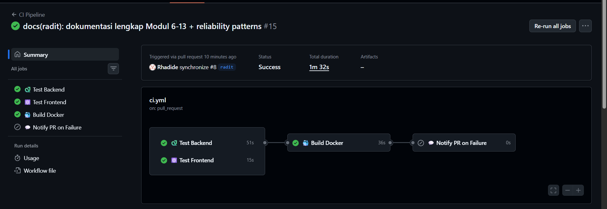
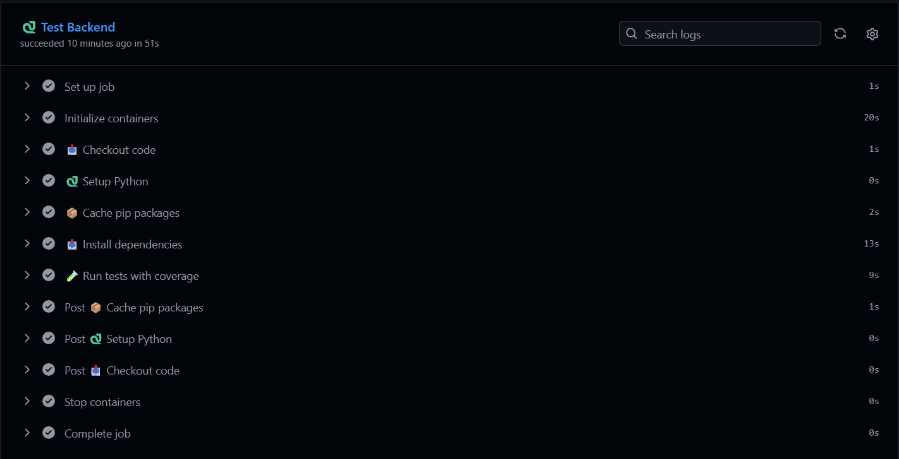
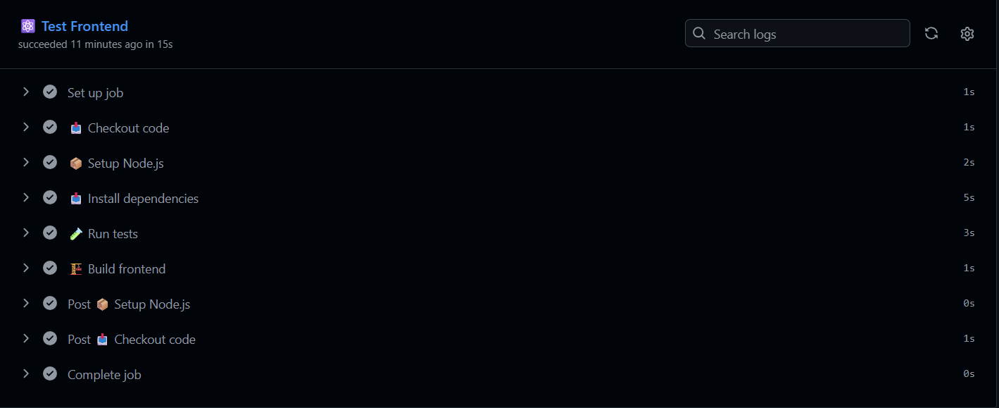
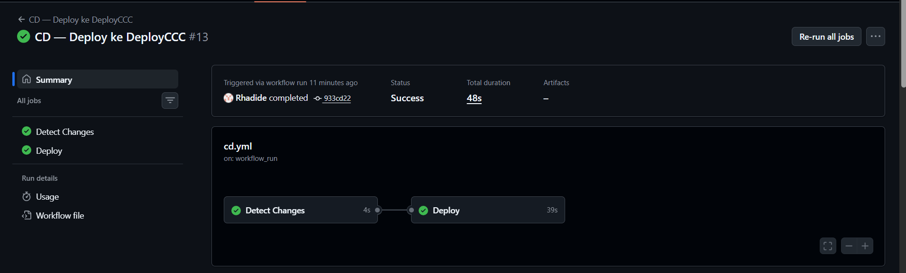
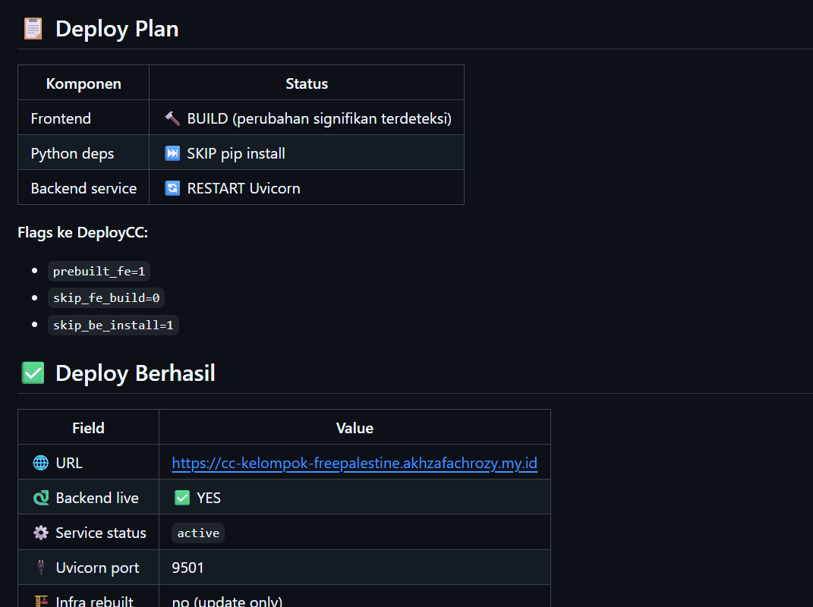
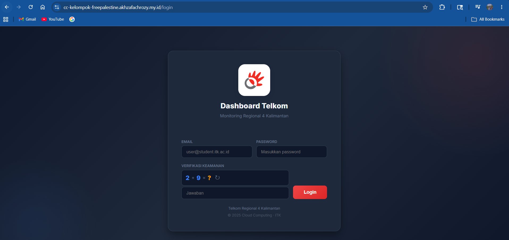
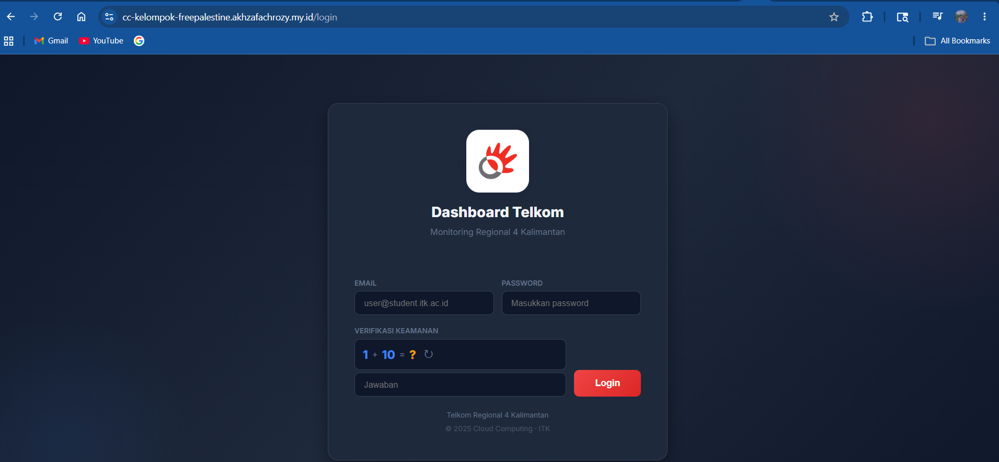
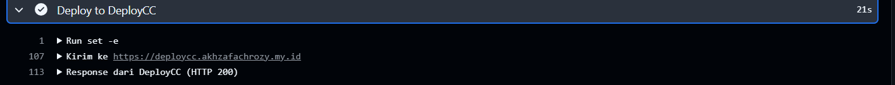

# Laporan CI/CD Pipeline — Modul 10 & 11

**Lead QA & Docs:** Raditya Yudianto (10231076)  
**Tanggal:** 17 Mei 2026

---

## Screenshot Bukti CI Pipeline Berjalan

### 1. CI Pipeline Passing — GitHub Actions

> **Screenshot:** `docs/screenshots/modul10-ci-passing.png`

*Keterangan: Tampilan tab GitHub Actions menunjukkan semua 4 jobs berhasil (centang hijau):*
- ✅ `🐍 Test Backend` — pytest test_main.py passing
- ✅ `⚛️ Test Frontend` — Vitest + build passing
- ✅ `🐳 Build Docker` — image backend & frontend berhasil dibuild
- ✅ `💬 Notify PR` — (skipped pada push ke main, tidak error)

---

### 2. Detail Hasil Backend Test

> **Screenshot:** `docs/screenshots/modul10-backend-test-detail.png`

*Keterangan: Tampilan log step "Run tests with coverage" di GitHub Actions menunjukkan output pytest dengan semua test PASSED.*

---

### 3. Detail Hasil Frontend Test

> **Screenshot:** `docs/screenshots/modul10-frontend-test-detail.png`

*Keterangan: Tampilan log step "Run tests" di GitHub Actions menunjukkan output Vitest dengan semua 16 test PASSED.*

---

## Screenshot CD Pipeline — DeployCC

### 4. CD Pipeline Sukses

> **Screenshot:** `docs/screenshots/modul11-cd-success.png`

*Keterangan: Tampilan tab GitHub Actions workflow "CD — Deploy ke DeployCCC" dengan status sukses setelah merge ke main.*

---

### 5. Summary Deploy — URL Aplikasi

> **Screenshot:** `docs/screenshots/modul11-deploy-summary.png`

*Keterangan: Tampilan Summary dari job Deploy di GitHub Actions yang menampilkan:*
- URL live aplikasi: `https://cc-kelompok-freepalestine.akhzafachrozy.my.id`
- SSH credentials
- Port Uvicorn

---

### 6. Aplikasi Live — Health Check

> **Screenshot:** `docs/screenshots/modul11-health-check.png`

*Keterangan: Browser membuka URL `https://cc-kelompok-freepalestine.akhzafachrozy.my.id/health` dan menampilkan `{"status": "healthy"}`.*

---

### 7. Aplikasi Live — Frontend Login Page

> **Screenshot:** `docs/screenshots/modul11-frontend-live.png`

*Keterangan: Browser membuka URL frontend production dan menampilkan halaman login Dashboard Telkom.*

---

### 8. Service Status di Server

> **Screenshot:** `docs/screenshots/modul11-service-status.png`

*Keterangan: Terminal SSH ke server menjalankan `systemctl status deploycc-*.service` dan menampilkan status `active (running)`.*

---

## CI Badge

Status CI pipeline bisa dilihat di badge berikut:

---

*Laporan dibuat oleh Raditya Yudianto (10231076) — Lead QA & Docs*
