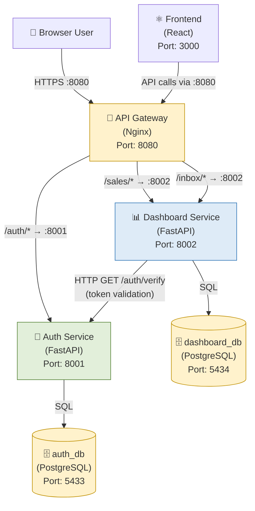
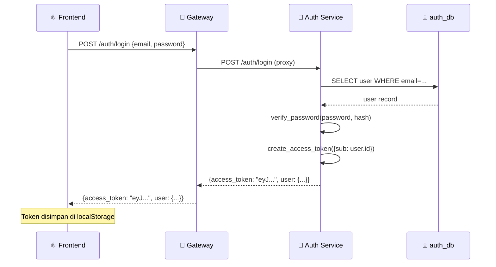
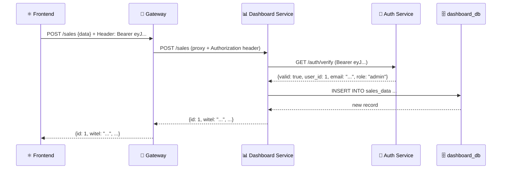

# Dokumentasi Microservices — Modul 12 & 13

**Lead QA & Docs:** Raditya Yudianto (10231076)  
**Mata Kuliah:** Komputasi Awan — Modul 12 (Microservices Decomposition) & Modul 13 (Reliability)  
**Tanggal:** 17 Mei 2026

---

## 1. Pendahuluan

Pada Modul 12, tim melakukan **dekomposisi monolith** menjadi arsitektur microservices. Monolith yang telah dibangun di Modul 1-11 dipecah menjadi **service-service independen**, masing-masing dengan database sendiri dan tanggung jawab yang jelas.

---

## 2. Perbandingan: Monolith vs Microservices

### Monolith (Modul 1-11)

```
📦 Satu FastAPI App (backend/)
   ├── auth.py      (login, register, JWT)
   ├── main.py      (CRUD sales, inbox, upload)
   ├── models.py    (User, SalesData, InboxItem)
   └── 🗄️ 1 Database (cloudapp PostgreSQL)
```

### Microservices (Modul 12+)

```
🔐 Auth Service (services/auth-service/)
   ├── main.py      (POST /auth/register, POST /auth/login, GET /auth/verify)
   └── 🗄️ auth_db (PostgreSQL - only users table)

📊 Dashboard Service (services/dashboard-service/)
   ├── main.py      (CRUD sales, inbox, monthly, summary)
   └── 🗄️ dashboard_db (PostgreSQL - sales_data, inbox_items)

🚪 API Gateway (services/gateway/)
   └── nginx.conf   (reverse proxy, rate limiting)

⚛️ Frontend (frontend/)
   └── React SPA    (akses via Gateway :8080)
```

---

## 3. Arsitektur Microservices — Diagram



---

## 4. Service Map

| Service | Tanggung Jawab | Port | Database | File |
|---------|---------------|------|----------|------|
| **Auth Service** | Register, Login, JWT token management, Token verification | 8001 | `auth_db` (users) | `services/auth-service/main.py` |
| **Dashboard Service** | CRUD Sales & Inbox, Summary, Monthly, Stats | 8002 | `dashboard_db` (sales_data, inbox_items) | `services/dashboard-service/main.py` |
| **API Gateway** | Routing, Rate limiting, Security headers, Reverse proxy | 8080 | — | `services/gateway/nginx.conf` |
| **Frontend** | React SPA, UI/UX | 3000 | — | `frontend/src/` |

---

## 5. API Contract

### Auth Service Endpoints

| Method | Endpoint | Deskripsi | Auth |
|--------|----------|-----------|------|
| `GET` | `/health` | Health check Auth Service | ❌ |
| `GET` | `/metrics` | Request metrics dan latency | ❌ |
| `POST` | `/auth/register` | Register user baru | ❌ |
| `POST` | `/auth/login` | Login, return JWT token | ❌ |
| `GET` | `/auth/me` | Profil user saat ini | ✅ JWT |
| `GET` | `/auth/verify` | Verifikasi token (dipanggil Dashboard Service) | ✅ JWT |

### Dashboard Service Endpoints

| Method | Endpoint | Deskripsi | Auth |
|--------|----------|-----------|------|
| `GET` | `/health` | Health check + circuit breaker status | ❌ |
| `GET` | `/metrics` | Metrics + circuit breaker state | ❌ |
| `POST` | `/sales` | Tambah data revenue | ✅ JWT |
| `GET` | `/sales` | List data revenue (dengan filter) | ✅ JWT |
| `GET` | `/sales/summary` | Ringkasan revenue (total, achievement) | ✅ JWT |
| `GET` | `/sales/monthly` | Data revenue per bulan (chart) | ✅ JWT |
| `GET` | `/sales/{id}` | Detail satu record | ✅ JWT |
| `PUT` | `/sales/{id}` | Update record | ✅ JWT |
| `DELETE` | `/sales/{id}` | Hapus record | ✅ JWT |
| `POST` | `/inbox` | Tambah tiket | ✅ JWT |
| `GET` | `/inbox` | List tiket (dengan filter) | ✅ JWT |
| `GET` | `/inbox/stats` | Statistik tiket per status | ✅ JWT |
| `GET` | `/inbox/{id}` | Detail tiket | ✅ JWT |
| `PUT` | `/inbox/{id}` | Update tiket | ✅ JWT |
| `DELETE` | `/inbox/{id}` | Hapus tiket | ✅ JWT |

### API Gateway Routes (Nginx)

| Path Pattern | Diteruskan ke | Rate Limit |
|-------------|---------------|------------|
| `/auth/login` | auth-service:8001 | 10 req/menit (brute force protection) |
| `/auth/*` | auth-service:8001 | 30 req/detik |
| `/sales/*` | dashboard-service:8002 | 30 req/detik |
| `/inbox/*` | dashboard-service:8002 | 30 req/detik |
| `/health` | Gateway itself | — |
| `/health/auth` | auth-service:8001/health | — |
| `/health/dashboard` | dashboard-service:8002/health | — |

---

## 6. Alur Request — Sequence Diagram

### Alur 1: Login User



### Alur 2: Buat Data Revenue (dengan token)



---

## 7. Database per Service

### Konsep Database per Service

Setiap service memiliki database sendiri — **service TIDAK boleh mengakses database service lain secara langsung**.

| Aspek | Monolith | Microservices |
|-------|----------|---------------|
| Jumlah database | 1 | 1 per service (2 total) |
| Tabel users | `cloudapp.users` | `auth_db.users` |
| Tabel sales | `cloudapp.sales_data` | `dashboard_db.sales_data` |
| Tabel inbox | `cloudapp.inbox_items` | `dashboard_db.inbox_items` |
| Foreign key user→sales | FK langsung | Integer reference (no FK!) |

### Schema: auth_db.users

```sql
CREATE TABLE users (
    id                SERIAL PRIMARY KEY,
    email             VARCHAR(255) UNIQUE NOT NULL,
    name              VARCHAR(100) NOT NULL,
    hashed_password   VARCHAR(255) NOT NULL,
    role              VARCHAR(20) DEFAULT 'viewer',
    is_active         BOOLEAN DEFAULT true,
    created_at        TIMESTAMPTZ DEFAULT NOW()
);
```

### Schema: dashboard_db.sales_data

```sql
CREATE TABLE sales_data (
    id               SERIAL PRIMARY KEY,
    witel            VARCHAR(50) NOT NULL,
    channel          VARCHAR(50) NOT NULL,
    product          VARCHAR(50) DEFAULT 'HSI',
    revenue_target   FLOAT NOT NULL DEFAULT 0,
    revenue_actual   FLOAT NOT NULL DEFAULT 0,
    sales_target     INT NOT NULL DEFAULT 0,
    sales_actual     INT NOT NULL DEFAULT 0,
    period_month     INT NOT NULL,
    period_year      INT NOT NULL,
    created_by       INT,  -- Reference ke auth_db.users.id (NO FK!)
    created_at       TIMESTAMPTZ DEFAULT NOW(),
    updated_at       TIMESTAMPTZ
);
```

> ⚠️ **Catatan**: `created_by` di `sales_data` adalah integer biasa (bukan foreign key) — referensi ke user id di `auth_db`. Konsistensi dijaga di level aplikasi.

---

## 8. Cara Menjalankan Microservices

### Menggunakan Docker Compose (Microservices)

```bash
# Jalankan semua services microservices
docker compose -f docker-compose.microservices.yml up --build -d

# Cek status semua container
docker compose -f docker-compose.microservices.yml ps

# Lihat logs per service
docker compose -f docker-compose.microservices.yml logs -f auth-service
docker compose -f docker-compose.microservices.yml logs -f dashboard-service
```

### Akses Services

| URL | Deskripsi |
|-----|-----------|
| `http://localhost:3000` | Frontend React |
| `http://localhost:8080` | API Gateway |
| `http://localhost:8080/health` | Gateway health check |
| `http://localhost:8080/health/auth` | Auth Service health |
| `http://localhost:8080/health/dashboard` | Dashboard Service health |
| `http://localhost:8001/docs` | Auth Service Swagger |
| `http://localhost:8002/docs` | Dashboard Service Swagger |

---

## 9. Structured Logging & Observability (Modul 14)

Kedua service menggunakan **JSON structured logging** dengan correlation ID:

```json
{
  "timestamp": "2026-05-17T10:30:00Z",
  "level": "INFO",
  "service": "dashboard-service",
  "message": "GET /sales -> 200 (0.045s)",
  "correlation_id": "a1b2c3d4-e5f6-7890-abcd-ef1234567890"
}
```

**Correlation ID** (`X-Correlation-ID`) diteruskan dari Gateway ke setiap service untuk tracing request end-to-end.

---

*Dokumentasi dibuat oleh Raditya Yudianto (10231076) — Lead QA & Docs*  
*Mengacu pada implementasi di `services/auth-service/main.py` dan `services/dashboard-service/main.py`*
