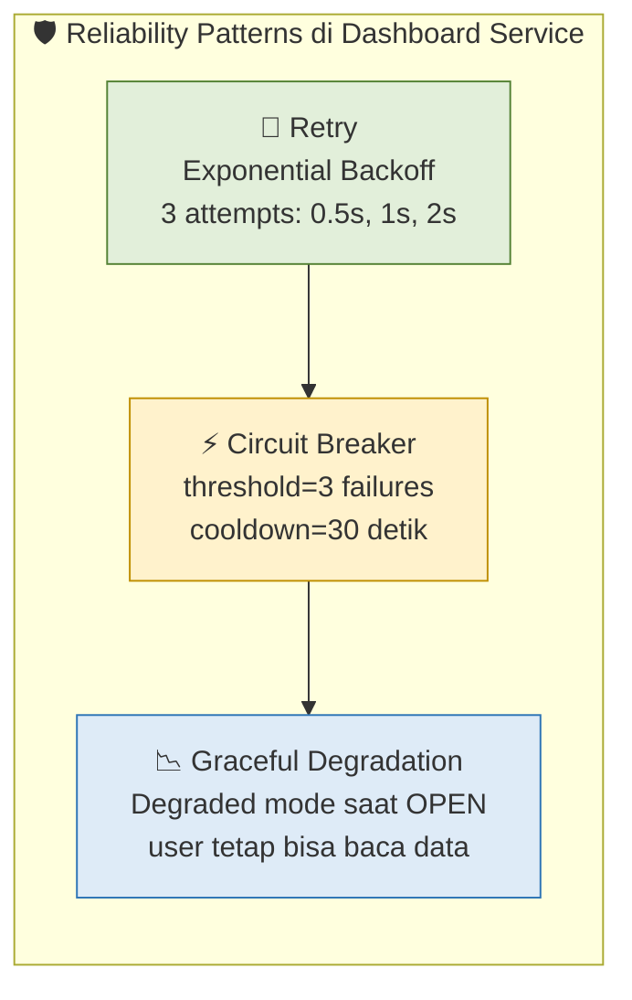
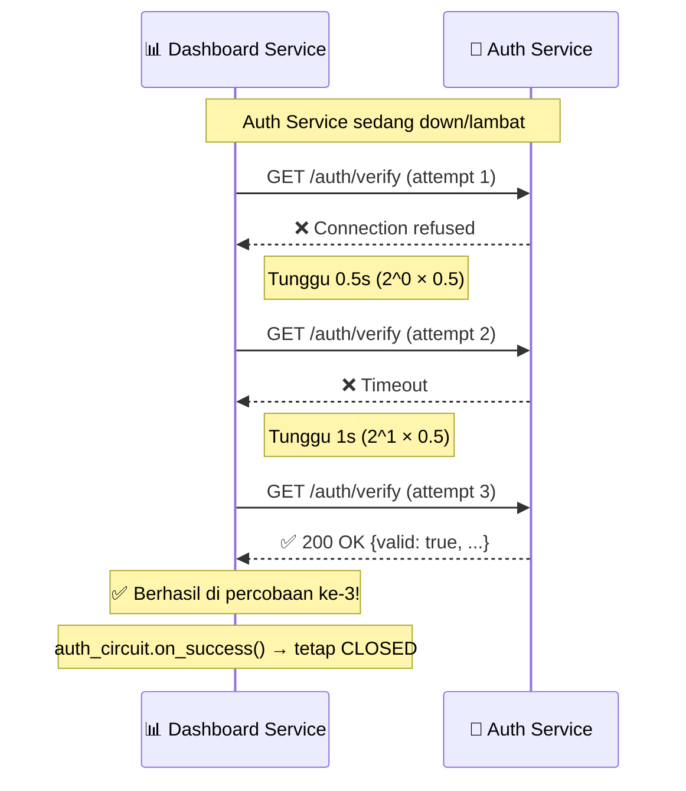
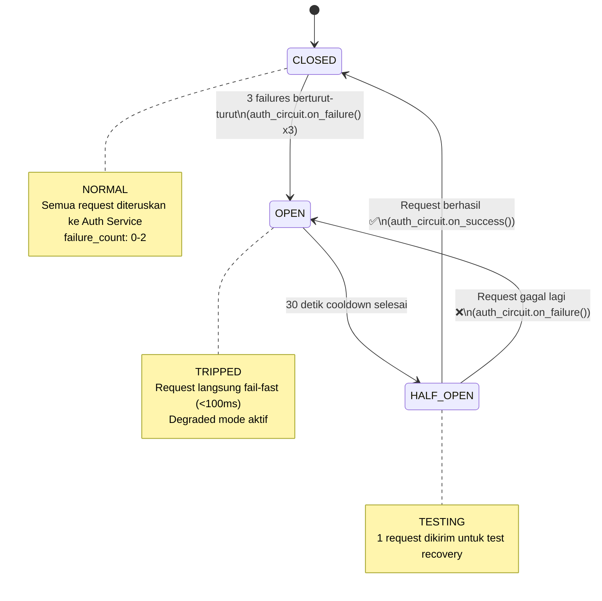

# Dokumentasi Reliability Patterns — Modul 13

**Lead QA & Docs:** Raditya Yudianto (10231076)  
**Mata Kuliah:** Komputasi Awan — Modul 13 (Microservices Reliability)  
**Tanggal:** 17 Mei 2026

---

## 1. Pendahuluan: Masalah Reliability di Microservices

Di arsitektur monolith, semua fungsi dipanggil **in-process** — selalu berhasil selama server hidup. Di microservices, setiap komunikasi antar service melewati **jaringan** — dan jaringan bisa gagal.

### Skenario Kegagalan yang Mungkin Terjadi

| Skenario | Dampak tanpa Reliability | Dampak dengan Reliability |
|----------|--------------------------|---------------------------|
| Auth Service crash | Semua CRUD item gagal (timeout 5 detik per request) | Fast fail dalam milidetik; degraded mode |
| Network lambat | User menunggu lama; request menumpuk | Retry dengan backoff; circuit breaker trip |
| Auth Service overloaded | Cascading failure seluruh sistem | Circuit breaker lindungi downstream services |
| Auth Service restart (sementara) | Banyak request gagal | Retry berhasil di percobaan ke-2 atau ke-3 |

---

## 2. Tiga Pilar Reliability



---

## 3. Implementasi Retry dengan Exponential Backoff

### Lokasi: `services/dashboard-service/main.py`

```python
async def verify_token_with_retry(token: str, max_retries=3) -> dict:
    """Verify token via Auth Service with exponential backoff retry."""
    if not auth_circuit.can_execute():
        # Circuit OPEN — langsung ke degraded mode
        return {"valid": True, "user_id": 0, "email": "degraded@mode", "role": "viewer"}

    for attempt in range(max_retries):
        try:
            async with httpx.AsyncClient(timeout=5.0) as client:
                response = await client.get(
                    f"{AUTH_SERVICE_URL}/auth/verify",
                    headers={"Authorization": f"Bearer {token}"}
                )
                if response.status_code == 200:
                    auth_circuit.on_success()
                    return response.json()
                else:
                    raise Exception(f"Auth returned {response.status_code}")
        except Exception as e:
            wait_time = (2 ** attempt) * 0.5  # 0.5s → 1s → 2s
            logger.warning(f"Auth verify attempt {attempt+1}/{max_retries} failed. Retry in {wait_time}s")
            if attempt < max_retries - 1:
                time.sleep(wait_time)

    auth_circuit.on_failure()
    raise HTTPException(status_code=503, detail="Auth service tidak tersedia")
```

### Visualisasi Exponential Backoff



### Strategi Retry

| Percobaan | Delay | Total waktu tunggu |
|-----------|-------|--------------------|
| Attempt 1 | 0ms (langsung) | 0ms |
| Attempt 2 | 500ms (2^0 × 0.5s) | 500ms |
| Attempt 3 | 1000ms (2^1 × 0.5s) | 1500ms |
| Gagal semua | — | ~1.5s + timeout overhead |

---

## 4. Implementasi Circuit Breaker

### Lokasi: `services/dashboard-service/main.py`

```python
class CircuitBreaker:
    def __init__(self, failure_threshold=3, recovery_timeout=30):
        self.failure_threshold = failure_threshold  # Trip setelah 3 failures
        self.recovery_timeout = recovery_timeout    # Cooldown 30 detik
        self.failure_count = 0
        self.state = CircuitState.CLOSED            # CLOSED, OPEN, HALF_OPEN
        self.last_failure_time = 0

    def can_execute(self) -> bool:
        if self.state == CircuitState.CLOSED:
            return True
        if self.state == CircuitState.OPEN:
            if time.time() - self.last_failure_time > self.recovery_timeout:
                self.state = CircuitState.HALF_OPEN  # Test apakah service sudah pulih
                return True
            return False  # Masih cooldown — tolak langsung (fast fail)
        return True  # HALF_OPEN — izinkan 1 test request
```

### State Machine Circuit Breaker



### Behavior per State

| State | Behavior | User Experience |
|-------|----------|----------------|
| **CLOSED** | Request diteruskan ke Auth Service (dengan retry) | Normal — semua fitur berfungsi |
| **OPEN** | Request langsung ditolak tanpa memanggil Auth | Fast fail — degraded mode (baca data tetap bisa) |
| **HALF_OPEN** | 1 request test dikirim | Satu user mendapat response normal/error |

---

## 5. Graceful Degradation

Saat circuit breaker OPEN, Dashboard Service **tidak langsung error** — ia masuk ke **degraded mode**:

```python
if not auth_circuit.can_execute():
    logger.warning("Circuit OPEN — using degraded mode (skipping auth verification)")
    # Return dummy user info agar endpoint tetap bisa diakses
    return {"valid": True, "user_id": 0, "email": "degraded@mode", "role": "viewer"}
```

### Behavior dalam Degraded Mode

| Endpoint | Full Mode (Circuit CLOSED) | Degraded Mode (Circuit OPEN) |
|----------|---------------------------|------------------------------|
| `GET /sales` | Return data user yang login | Return data (user_id=0) |
| `POST /sales` | Create dengan owner_id user | Create dengan owner_id=0 |
| `GET /health` | `{"status": "healthy", "circuit_breaker": {"state": "closed"}}` | `{"status": "healthy", "circuit_breaker": {"state": "open"}}` |

---

## 6. Monitoring Circuit Breaker via Health Endpoint

Circuit breaker status dapat dipantau via endpoint `/health`:

```bash
curl http://localhost:8002/health
```

**Response saat CLOSED (normal):**
```json
{
  "status": "healthy",
  "service": "dashboard-service",
  "version": "2.0.0",
  "circuit_breaker": {
    "state": "closed",
    "failure_count": 0,
    "threshold": 3
  }
}
```

**Response saat OPEN (Auth Service down):**
```json
{
  "status": "healthy",
  "service": "dashboard-service",
  "version": "2.0.0",
  "circuit_breaker": {
    "state": "open",
    "failure_count": 3,
    "threshold": 3
  }
}
```

---

## 7. Cara Menguji Reliability

### Test 1: Retry Pattern

```bash
# 1. Jalankan semua container
docker compose -f docker-compose.microservices.yml up -d

# 2. Login untuk dapat token
TOKEN=$(curl -s -X POST http://localhost:8080/auth/login \
  -H "Content-Type: application/json" \
  -d '{"email":"ariel@student.itk.ac.id","password":"password123"}' | \
  python -c "import sys,json; print(json.load(sys.stdin)['access_token'])")

# 3. Test normal (Auth Service up)
curl http://localhost:8080/sales -H "Authorization: Bearer $TOKEN"
# → Harus berhasil ✅

# 4. Stop Auth Service
docker compose -f docker-compose.microservices.yml stop auth-service

# 5. Test saat Auth Service down (lihat retry logs)
curl http://localhost:8080/sales -H "Authorization: Bearer $TOKEN"
# → Harus ada 3 retry, lalu 503

# 6. Lihat retry log di Dashboard Service
docker compose -f docker-compose.microservices.yml logs dashboard-service --tail=20
# Akan tampil: "attempt 1/3 failed", "Retry in 0.5s", dst.
```

### Test 2: Circuit Breaker

```bash
# 1. Kirim 4+ request saat Auth down (trigger circuit open)
for i in $(seq 1 5); do
  curl -s http://localhost:8080/sales \
    -H "Authorization: Bearer $TOKEN" | python -c "import sys,json; d=json.load(sys.stdin); print(d.get('detail','OK'))"
done

# 2. Cek circuit breaker OPEN
curl http://localhost:8002/health
# → state: "open"

# 3. Request berikutnya — fast fail (tanpa menunggu retry)
time curl -s http://localhost:8080/sales -H "Authorization: Bearer $TOKEN"
# → Sangat cepat (<50ms) karena circuit breaker menolak langsung

# 4. Hidupkan kembali Auth Service
docker compose -f docker-compose.microservices.yml start auth-service

# 5. Tunggu cooldown 30 detik, lalu cek health
sleep 35
curl http://localhost:8002/health
# → state: "half_open" atau "closed"
```

---

## 8. Konfigurasi Circuit Breaker

| Parameter | Nilai | Deskripsi |
|-----------|-------|-----------|
| `failure_threshold` | 3 | Jumlah failure berturut yang men-trip circuit |
| `recovery_timeout` | 30 detik | Durasi cooldown sebelum masuk HALF_OPEN |
| HTTP timeout | 5 detik | Timeout per request ke Auth Service |
| Max retries | 3 | Jumlah maksimum percobaan retry |
| Base delay | 0.5 detik | Delay awal exponential backoff |

---

## 9. Lessons Learned

1. **Retry saja tidak cukup** — tanpa circuit breaker, retry terus-menerus membuat Auth Service semakin kewalahan (thundering herd problem)
2. **Fast fail lebih baik** dari menunggu timeout — user mendapat error dalam milidetik, bukan 15 detik (3 retry × 5 detik timeout)
3. **Degraded mode penting** — sistem tetap bisa memberikan layanan (walaupun terbatas) saat dependency down
4. **Observability kunci** — circuit breaker status di `/health` memungkinkan monitoring dan alerting

---

*Dokumentasi dibuat oleh Raditya Yudianto (10231076) — Lead QA & Docs*  
*Mengacu pada implementasi Circuit Breaker dan Retry di `services/dashboard-service/main.py`*
