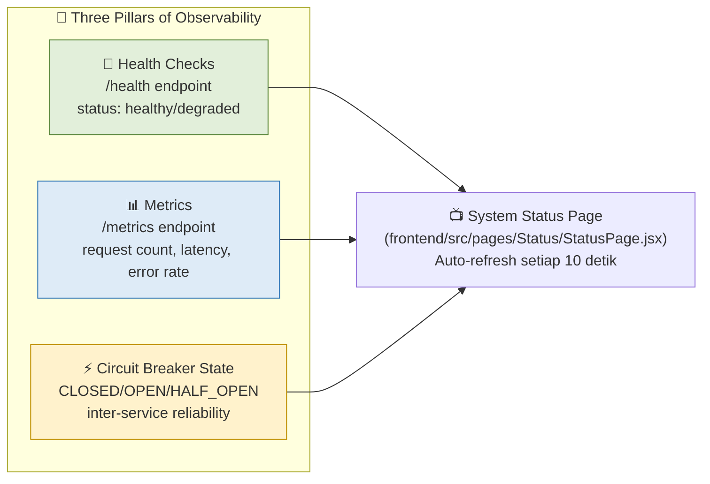
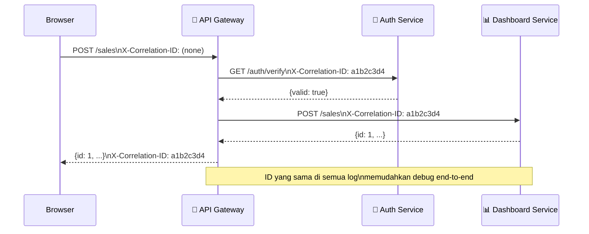

# Dokumentasi Modul 14 — Monitoring & Observability

**Lead QA & Docs:** Raditya Yudianto (10231076)  
**Tanggal:** 24 Mei 2026  
**Referensi implementasi:** `frontend/src/pages/Status/StatusPage.jsx`

---

## 1. Pendahuluan: Three Pillars of Observability

Di arsitektur microservices, kita tidak bisa hanya mengandalkan "aplikasi berjalan" sebagai tanda sistem sehat. Kita butuh **Observability** — kemampuan untuk memahami kondisi internal sistem dari output eksternal.



---

## 2. System Status Page (Modul 14)

### Apa itu StatusPage?

File: `frontend/src/pages/Status/StatusPage.jsx`

Halaman monitoring real-time yang menampilkan status semua microservices sekaligus. Dapat diakses dari menu navigasi sidebar.

### Fitur StatusPage

| Fitur | Detail |
|-------|--------|
| **Auto-refresh** | Update otomatis setiap 10 detik |
| **Manual refresh** | Tombol "Refresh" dengan animasi spinning |
| **Service cards** | Card per service dengan status badge berwarna |
| **Circuit Breaker display** | Tampilkan state CB (CLOSED/OPEN/HALF_OPEN) dan failure count |
| **Metrics panel** | Request total, error count, error rate %, avg latency |
| **Status color coding** | Hijau (healthy), kuning (degraded), merah (unhealthy), abu (unreachable) |

### Services yang Dipantau

| Service | URL Health | URL Metrics | Port |
|---------|-----------|-------------|------|
| **Auth Service** | `GATEWAY/health/auth` | `GATEWAY/metrics/auth` | 8001 |
| **Dashboard Service** | `GATEWAY/health/dashboard` | `GATEWAY/metrics/dashboard` | 8002 |
| **API Gateway** | `GATEWAY/health` | — | 8080 |
| **Monolith Backend** | `VITE_API_URL/health` | — | 8000 |

---

## 3. Health Check Endpoints

### Format Response Health Check

**Auth Service (`/health`):**
```json
{
  "status": "healthy",
  "service": "auth-service",
  "version": "2.0.0",
  "timestamp": "2026-05-24T10:00:00Z"
}
```

**Dashboard Service (`/health`) — dengan Circuit Breaker:**
```json
{
  "status": "healthy",
  "service": "dashboard-service",
  "version": "2.0.0",
  "circuit_breaker": {
    "state": "closed",
    "failure_count": 0,
    "threshold": 3
  }
}
```

**Status Values:**

| Status | Warna | Kondisi |
|--------|-------|---------|
| `healthy` | 🟢 Hijau | Service berjalan normal |
| `degraded` | 🟡 Kuning | Service berjalan tapi ada masalah minor |
| `unhealthy` | 🔴 Merah | Service ada error kritis |
| `unreachable` | ⚫ Abu | Tidak bisa connect (timeout 5 detik) |

---

## 4. Metrics Endpoint

### Format Response Metrics (`/metrics`)

```json
{
  "requests_total": 1247,
  "errors_total": 3,
  "avg_latency_seconds": 0.045,
  "requests_by_status": {
    "200": 1230,
    "401": 10,
    "500": 3,
    "404": 4
  },
  "circuit_breaker": {
    "state": "closed",
    "failure_count": 0
  }
}
```

### Kalkulasi yang Ditampilkan di UI

| Metric | Rumus |
|--------|-------|
| **Error Rate** | `(errors_total / requests_total) × 100%` |
| **Avg Latency** | `avg_latency_seconds × 1000` (ditampilkan dalam ms) |

---

## 5. Correlation ID — Request Tracing

Setiap request yang masuk ke sistem mendapat **Correlation ID** unik (UUID). ID ini diteruskan via header `X-Correlation-ID` ke semua service downstream.



**Manfaat Correlation ID:**
- Bisa trace satu request dari Gateway → Auth → Dashboard di log
- Memudahkan debugging ketika ada error di salah satu service
- Cukup cari satu UUID di semua log service untuk lihat full flow

---

## 6. Structured Logging (JSON Format)

Semua service menggunakan **JSON structured logging** agar mudah di-parse oleh monitoring tools:

```json
{
  "timestamp": "2026-05-24T10:30:00Z",
  "level": "INFO",
  "service": "dashboard-service",
  "message": "GET /sales -> 200 (0.045s)",
  "correlation_id": "a1b2c3d4-e5f6-7890-abcd-ef1234567890",
  "method": "GET",
  "path": "/sales",
  "status_code": 200,
  "latency_seconds": 0.045
}
```

Keuntungan vs plain text logging:
- ✅ Mudah di-filter (`jq '.level == "ERROR"'`)
- ✅ Mudah di-aggregate (hitung request per menit)
- ✅ Bisa di-ingest ke tools seperti Grafana, ELK Stack, Datadog

---

## 7. Cara Akses System Status Page

### Development (local):
1. Jalankan semua services: `docker compose -f docker-compose.microservices.yml up -d`
2. Buka browser: `http://localhost:3000`
3. Login → klik **"System Status"** di sidebar kiri

### Production:
1. Buka: `https://cc-kelompok-freepalestine.akhzafachrozy.my.id`
2. Login → klik **"System Status"** di sidebar

---

## 8. Screenshot Bukti

### System Status Page (Monitoring Dashboard)

> **Screenshot:** `docs/screenshots/modul14-status-page.png`


*Keterangan: Halaman System Status menampilkan 4 service cards dengan status real-time, circuit breaker state, dan metrics (request count, error rate, latency).*

---

## 9. Integrasi dengan Circuit Breaker (Modul 13)

Status page secara langsung menampilkan state circuit breaker dari Dashboard Service:

```
Circuit Breaker: [CLOSED] (0/3 failures)
```

Ketika Auth Service down:
```
Circuit Breaker: [OPEN] (3/3 failures)
```

Ini memungkinkan tim **langsung tahu** status reliability inter-service tanpa perlu masuk ke server atau cek log manual.

---

*Dokumentasi dibuat oleh Raditya Yudianto (10231076) — Lead QA & Docs*  
*Berdasarkan implementasi di `frontend/src/pages/Status/StatusPage.jsx` oleh Ariel Itsbat Nurhaq*
