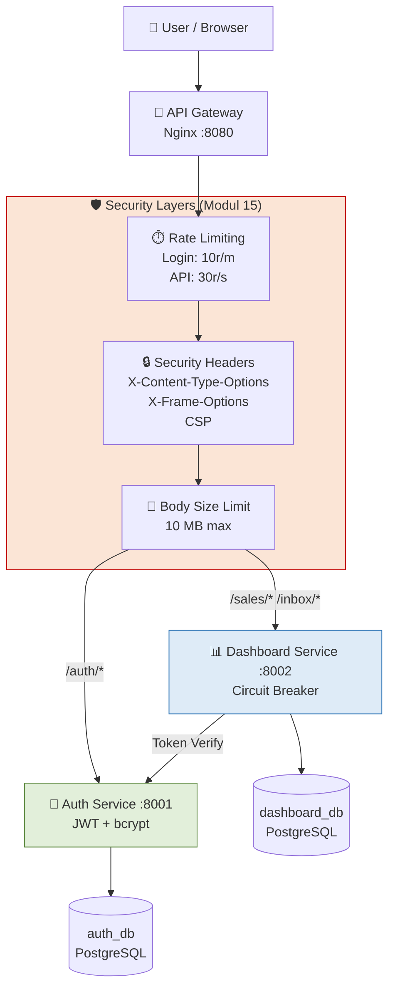
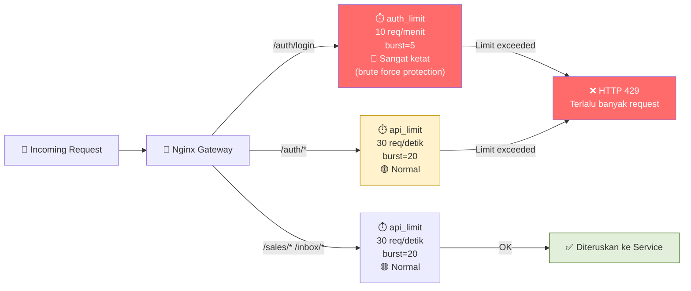

# Dokumentasi Modul 15 — Security, Final Polish & Dokumentasi

**Lead QA & Docs:** Raditya Yudianto (10231076)  
**Tanggal:** 24 Mei 2026  
**Status:** ✅ Security hardening aktif di production

---

## 1. Security Architecture Overview



---

## 2. Security Checklist — Hasil Audit

### 2.1 Secrets & Credentials

| Item | Status | Detail |
|------|--------|--------|
| Password tidak hardcoded | ✅ Pass | Semua via `os.getenv()` |
| `.env` di `.gitignore` | ✅ Pass | Tidak ter-commit |
| `.env.example` tersedia | ✅ Pass | `backend/.env.example` ada |
| `SECRET_KEY` dari env | ✅ Pass | `os.getenv("SECRET_KEY")` |
| Password database via env | ✅ Pass | `DATABASE_URL` dari environment |

### 2.2 Authentication & Authorization

| Item | Status | Detail |
|------|--------|--------|
| JWT dengan expiry | ✅ Pass | `ACCESS_TOKEN_EXPIRE_MINUTES=60` |
| Password bcrypt hash | ✅ Pass | `passlib[bcrypt]` digunakan |
| Rate limiting login | ✅ Pass | `10r/m` di Nginx (brute force protection) |
| Owner check per-request | ✅ Pass | Auth verify per setiap request ke Dashboard |

### 2.3 Network & Deployment

| Item | Status | Detail |
|------|--------|--------|
| CORS configured | ✅ Pass | `ALLOWED_ORIGINS` via env |
| Request body limit | ✅ Pass | `client_max_body_size 10M` |
| Security Headers | ✅ Pass | X-Content-Type, X-Frame, XSS, CSP, Referrer |
| Rate limiting API | ✅ Pass | `30r/s` untuk semua API routes |

### 2.4 Input Validation

| Item | Status | Detail |
|------|--------|--------|
| Pydantic schemas | ✅ Pass | Semua input divalidasi Pydantic v2 |
| EmailStr validation | ✅ Pass | `pydantic[email]` digunakan |
| SQL injection protection | ✅ Pass | SQLAlchemy ORM (no raw SQL) |

---

## 3. Rate Limiting di Nginx Gateway

Referensi: `services/gateway/nginx.conf`



### Konfigurasi Rate Limit

```nginx
# Zone untuk login (sangat ketat — cegah brute force)
limit_req_zone $binary_remote_addr zone=auth_limit:10m rate=10r/m;

# Zone untuk API umum
limit_req_zone $binary_remote_addr zone=api_limit:10m rate=30r/s;
```

| Endpoint | Zone | Rate | Burst | Alasan |
|----------|------|------|-------|--------|
| `/auth/login` | `auth_limit` | 10/menit | 5 | Cegah brute force password |
| `/auth/*` | `api_limit` | 30/detik | 20 | Auth normal |
| `/sales/*` | `api_limit` | 30/detik | 20 | Data API |
| `/inbox/*` | `api_limit` | 30/detik | 20 | Data API |

---

## 4. Security Headers

HTTP Security Headers yang aktif di semua response:

```nginx
add_header X-Content-Type-Options "nosniff" always;
add_header X-Frame-Options "DENY" always;
add_header X-XSS-Protection "1; mode=block" always;
add_header Referrer-Policy "strict-origin-when-cross-origin" always;
add_header Content-Security-Policy "default-src 'self'..." always;
```

| Header | Nilai | Proteksi |
|--------|-------|---------|
| `X-Content-Type-Options` | `nosniff` | MIME type sniffing attack |
| `X-Frame-Options` | `DENY` | Clickjacking via iframe |
| `X-XSS-Protection` | `1; mode=block` | Cross-Site Scripting |
| `Referrer-Policy` | `strict-origin-when-cross-origin` | Referrer info leakage |
| `Content-Security-Policy` | `default-src 'self'` | Code injection (XSS) |

---

## 5. OWASP Top 10 — Status per Risiko

| OWASP Risk | Status | Implementasi |
|------------|--------|-------------|
| **A01: Broken Access Control** | ✅ Aman | Auth verify per request via Auth Service |
| **A02: Cryptographic Failures** | ✅ Aman | bcrypt hashing, SECRET_KEY dari env |
| **A03: Injection** | ✅ Aman | SQLAlchemy ORM + Pydantic validation |
| **A07: Auth Failures** | ✅ Aman | JWT expiry 60 menit + rate limiting login |
| **A09: Security Logging** | ✅ Aman | Structured JSON logging dengan correlation ID |

---

## 6. Screenshot Bukti

### Security Headers Response

> **Screenshot:** `docs/screenshots/modul15-security-headers.png`


*Keterangan: Response header dari API Gateway menampilkan X-Content-Type-Options, X-Frame-Options, X-XSS-Protection, dan Content-Security-Policy aktif.*

### Rate Limiting (HTTP 429)

> **Screenshot:** `docs/screenshots/modul15-rate-limit-429.png`


*Keterangan: Response HTTP 429 saat endpoint /auth/login diakses melebihi 10 request/menit.*

---

## 7. Security Hardening & Polish (Modul 15 Updates)

Berdasarkan audit keamanan lanjutan dan polish sistem, kami menerapkan pembatasan input yang lebih ketat serta proteksi kebocoran informasi pada client-side:

### 7.1 Pengetatan Validasi Input Pydantic (Backend)
Untuk mencegah eksploitasi Resource Exhaustion (DoS) dan SQL Injection, kami mendefinisikan panjang maksimum (`max_length`) untuk field-field string yang rentan pada service backend:

*   **Auth Service (`UserCreate`):**
    *   `password`: Memiliki constraint panjang `min_length=8` dan baru ditambahkan limit `max_length=128`.
*   **Dashboard Service (`SalesCreate`):**
    *   `witel`: Diberikan limit `max_length=50`
    *   `channel`: Diberikan limit `max_length=50`
    *   `product`: Default `"HSI"`, diberikan limit `max_length=50`
*   **Dashboard Service (`InboxCreate`):**
    *   `title`: Tetap `min_length=1`, `max_length=200`
    *   `description`: Diberikan limit `max_length=2000`
    *   `witel`: Diberikan limit `max_length=50`
    *   `category`: Diberikan limit `max_length=50`
    *   `assigned_to`: Diberikan limit `max_length=100`

### 7.2 Proteksi Kebocoran Informasi (Frontend Client-Side)
Di lingkungan production, log konsol yang terlalu detail dapat membocorkan struktur data internal, URL endpoint API, atau error stack trace yang dapat dimanfaatkan oleh penyerang (Fingerprinting).

*   Kami membungkus seluruh `console.error` dan `console.log` di dalam file frontend inti dengan pengecekan lingkungan pengembangan (`import.meta.env.DEV`). Log hanya akan muncul jika aplikasi dijalankan di mode local development.
*   File yang dimodifikasi meliputi:
    *   `frontend/src/components/ErrorBoundary.jsx`
    *   `frontend/src/pages/Dashboard/HomeDashboard.jsx`
    *   `frontend/src/pages/Leaderboard/LeaderboardPage.jsx`
    *   `frontend/src/pages/Users/UsersPage.jsx`
    *   `frontend/src/utils/uploadEvents.js`

---

## 8. Kontribusi Lead QA & Docs — Modul 15

| Tugas | Status | Deliverable |
|-------|--------|-------------|
| Security audit (OWASP checklist) | ✅ Selesai | Dokumen ini |
| Dokumentasi rate limiting & security headers | ✅ Selesai | Section 3, 4 & 5 |
| Verifikasi hardening input backend & frontend | ✅ Selesai | Section 7 (Analisis Pydantic & Console Logger) |
| README final update | ✅ Selesai | `README.md` |
| Release notes M3 | ✅ Selesai | `docs/release-notes-m3.md` |
| Operations guide | ✅ Selesai | `docs/operations-guide.md` |

---

*Dokumentasi oleh Raditya Yudianto (10231076) — Lead QA & Docs*
