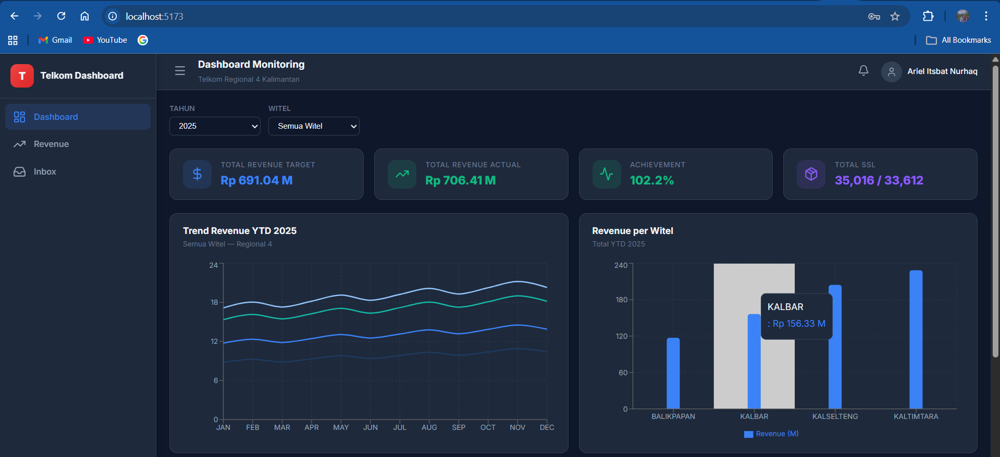
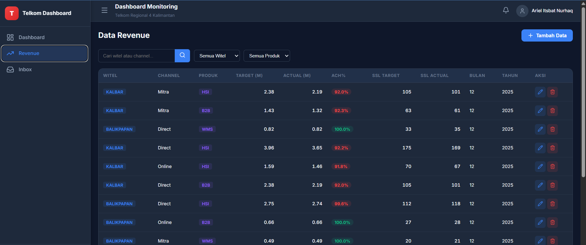

# Modul 3: Frontend React + Vite SPA

## 📌 Tujuan
Modul ini mendokumentasikan proses integrasi REST API yang telah dibuat pada Layer Backend ke dalam visualisasi antarmuka aplikasi. Frontend dibangun sebagai Single Page Application (SPA) menggunakan **React**, di-bundle oleh **Vite**, serta dirancang dengan desain modern.

## 🛠️ Tech Stack & Konfigurasi
- **Vite + React**: Konfigurasi server pada port `5173`.
- **Pages / Routing**: Auth Login, Dashboard, Modul Sales, Modul Inbox.
- **State Management**: React Hooks standar (`useState`, `useEffect`).
- **HTTP Client**: Menggunakan Axios instance untuk otomatis mengelola injeksi token Authorization JWT dan baseURL API.
- **Styling**: Vanilla CSS dengan desain Glassmorphism dan warna khas Telkom (Corporate Red & Grey).

## 🧩 Komponen Utama
Pengembangan dibagi menjadi beberapa komponen modular (`src/components/`) agar struktur rapi dan dapat digunakan ulang (Reusable Components).

1. **Sidebar Navigation**: Navigasi perpindahan routing aplikasi.
2. **Dashboard Summary Cards**: Menarik data aggregate dari backend (`/sales/summary`) dan menampilkannya sebagai *key performance indicator*.
3. **Data Tables**: Merender list payload response menjadi tabel interaktif.
4. **Recharts Integration**: Mentransformasikan data time-series (pendapatan bulanan) ke dalam visualisasi *Bar Chart* maupun *Pie Chart*.

## 🧪 Validasi Uji Coba UI/UX

Halaman Frontend langsung dikoneksikan dengan Backend. Proses *fetch* ke database berhasil dieksekusi secara mulus.

| Tampilan Halaman Dashboard |
| :---: |
|  |

| Tampilan Analitik / Tabel Data |
| :---: |
|  |
