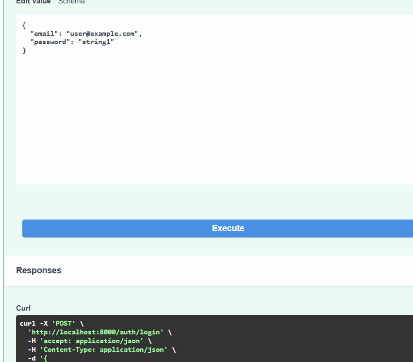
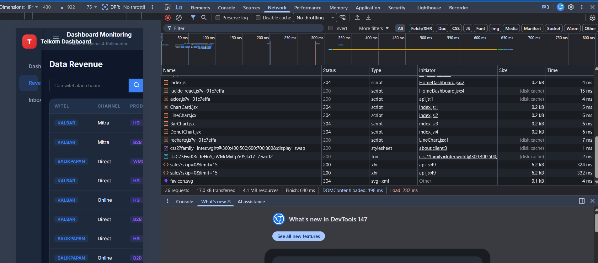

# Modul 4: Autentikasi JWT & CORS

## 📌 Tujuan
Modul ini mencakup implementasi sisi keamanan (Security) pada layer aplikasi. Dua aspek utama yang dikonfigurasi adalah **JSON Web Token (JWT)** untuk mekanisme login/otentikasi, serta aturan **Cross-Origin Resource Sharing (CORS)** agar UI Frontend diizinkan melakukan komunikasi data dengan API Backend.

## 🔐 Implementasi JWT Authentication
Aplikasi tidak menggunakan Sessions, melainkan *Stateless Token*. Implementasi `auth.py` mengatur *encryption*:
1. **Hashing Password**: Menggunakan `passlib[bcrypt]` untuk menyimpan sandi ke dalam bentuk *hash*.
2. **Access Token Generation**: Menggunakan `python-jose` untuk men-generate token JWT dengan skema standar *Bearer Token*, yang menyimpan subjek utama berupa `user_id`.
3. **Protection Middleware**: Menerapkan injeksi dependencies FastAPI (`Depends(get_current_user)`) ke endpoint-endpoint Private yang ada.

## 🚧 Konfigurasi CORS
Modifikasi pada parameter `FastAPI` instance:
```python
app.add_middleware(
    CORSMiddleware,
    allow_origins=["http://localhost:5173", "*"], # Diizinkan dari URL React Dev
    allow_credentials=True,
    allow_methods=["*"],
    allow_headers=["*"],
)
```

## 🧪 Validasi Pengujian Keamanan

Pengujian dilakukan dengan mensimulasikan login untuk menguji proses penukaran ID+Password menjadi sebuah Token Auth.

| Tes Verifikasi Login JWT & Token Response |
| :---: |
|  |

| Tes Integrasi CORS dari Network Browser |
| :---: |
|  |
