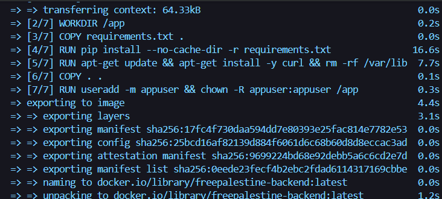

# Modul 5: Docker Containerisasi (Dockerfile)

## 📌 Tujuan
Menyiapkan *Virtual Environment Instance* portabel dengan membungkus keseluruhan kode sumber dan dependensinya ke dalam satu Container (Image) mandiri menggunakan **Docker**.

## 🐳 Desain Dockerfile
Kode aplikasi dipisahkan pengemasannya dari environment OS lokal agar mencegah masalah "it works on my machine".

Penulisan `Dockerfile` backend difokuskan pada ukuran *footprint* seminimal mungkin:
- **Base Image**: Menggunakan `python:3.12-slim` untuk merampingkan ukuran OS.
- **Copying Flow**: Menyalin file `requirements.txt` terlebih dahulu, dilanjutkan dengan tahap `pip install`. Teknik ini menggunakan konsep *Layer Caching* dari Docker sehingga ketika kode python dimodifikasi, build ulang tidak perlu mengunduh ulang *library*.
- **Expose Port**: Endpoint lokal 8000 dilingkup dalam port 8000 container.
- **Ignorances**: File rekam jejak virtual environment sistem host seperti folder `/venv/` maupun folder `__pycache__` di-blacklist menggunakan `.dockerignore`.

## 🧪 Validasi Image & Container Build

| Hasil Image & Eksekusi Build Docker Backend |
| :---: |
|  |

| Status Running Container via CLI/Desktop |
| :---: |
|  |
