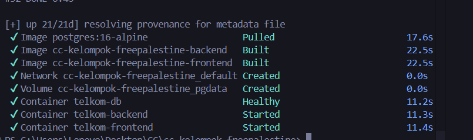
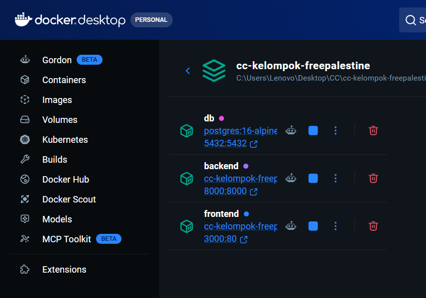

# Modul 6: Orchestration dengan Docker Compose

## 📌 Tujuan
Meningkatkan skala Containerisasi dari proses tunggal menjadi multi-container / Orkestrasi, sehingga Backend, Frontend, beserta ekosistem pendukung seperti Database (Postgres) dapat berjalan berkesinambungan secara paralel melalui skrip tunggal `docker-compose.yml`.

## 🌐 Arsitektur Microservices Compose
Di dalam skrip `docker-compose.yml`, kami mendefinisikan layer Topologi Network sebagai integrasi antarlayanan:
1. **Service Backend**: Melekat (binding) pada Dockerfile backend, dan menghubungkan host ke port aplikasi internal.
2. **Service Relasional Database**: Mengunduh base image `postgres:15-alpine`. Diberikan variable lingkungan khusus berupa DB Password dan Username yang dipasang otomatis kala inisiasi container. Database diekspos secara internal agar API Layer (Backend) bisa melempar data ke alamat server database tersebut (`host.docker.internal` -> atau penamaan *service network*-nya).
3. **Konfigurasi Volume**: Mengaplikasikan `volumes:` di dalam Postgres agar data-data penjualan tidak hilang (persistent) walaupun status container dimatikan (`compose down`).

## 🧪 Validasi Orchestration

Penyiapan container orkestrasi hanya bermodalkan `docker-compose up --build -d`. Laporan startup sukses dan terhubungnya berbagai layanan.

| Jalannya Docker Compose (CLI Log Success) |
| :---: |
|  |

| Cek Network Integrasi Compose Terhubung |
| :---: |
|  |
