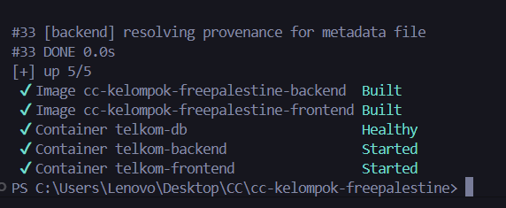
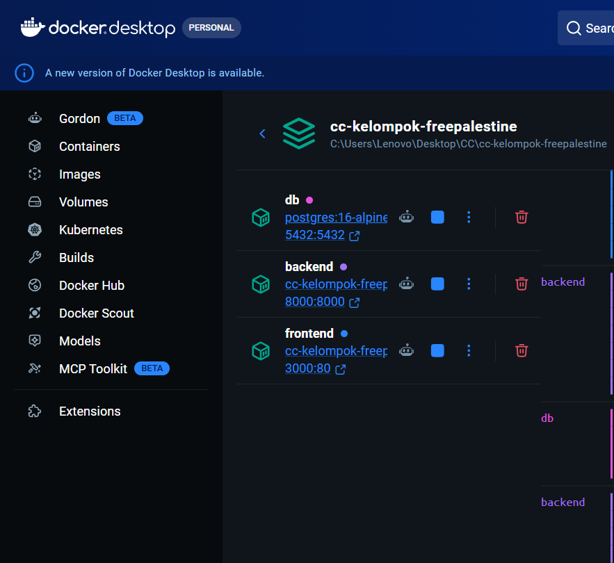
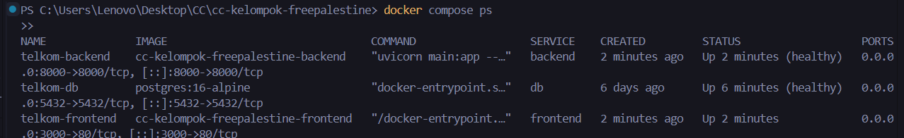
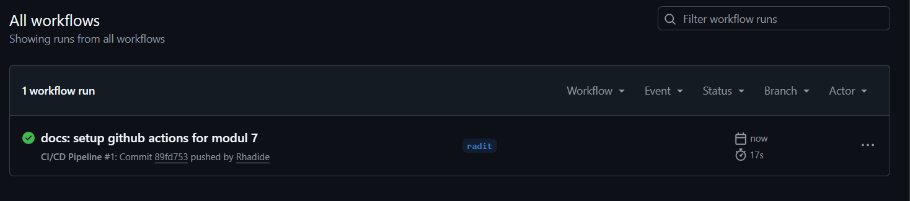

# Modul 7: Docker Compose — Orkestrasi Multi-Container

## 📌 Tujuan
Modul ini mendokumentasikan penggunaan **Docker Compose** untuk mengatur dan menjalankan seluruh komponen aplikasi (Database, Backend, Frontend) sekaligus melalui satu perintah tunggal, menggantikan proses menjalankan container satu per satu secara manual.

## 🌐 Arsitektur Compose

Seluruh layanan didefinisikan dalam satu file `docker-compose.yml` di root project. Tiga *service* utama terhubung dalam satu jaringan internal bernama `cloudnet`:

```
[Browser :3000]  →  [Frontend: Nginx+React]
                           ↓
                 [Backend: FastAPI :8000]
                           ↓
                 [Database: PostgreSQL]
                           ↓
                 [Volume: pgdata (Persistent)]
```

## 🗂️ Service yang Didefinisikan

| Service | Image / Build | Port | Fungsi |
|---------|--------------|------|--------|
| `db` | `postgres:16-alpine` | 5433:5432 | Database relasional (data persist via volume `pgdata`) |
| `backend` | Build dari `./backend/Dockerfile` | 8000:8000 | REST API FastAPI — menunggu `db` sehat sebelum start |
| `frontend` | Build dari `./frontend/Dockerfile` | 3000:80 | React SPA yang di-serve lewat Nginx |

## ⚙️ Konfigurasi Penting

- **`depends_on + healthcheck`**: Backend tidak akan startup sebelum PostgreSQL benar-benar siap menerima koneksi (`pg_isready`).
- **`restart: unless-stopped`**: Container otomatis nyala ulang jika crash.
- **`volumes: pgdata`**: Data database tetap ada walaupun container dimatikan (`docker compose down`).
- **`env_file`**: Konfigurasi sensitif (password, secret key) dibaca dari file `.env.docker`, tidak di-hardcode.

## 📋 Perintah Utama

| Perintah | Fungsi |
|----------|--------|
| `docker compose up --build -d` | Build semua image & jalankan semua service di background |
| `docker compose ps` | Cek status semua container (Running / Healthy) |
| `docker compose logs -f backend` | Pantau log realtime service backend |
| `docker compose down` | Hentikan & hapus semua container (data aman di volume) |
| `docker compose restart backend` | Restart satu service saja tanpa mematikan yang lain |

## 🧪 Validasi Orkestrasi

Seluruh service berhasil berjalan bersamaan, dibuktikan dari output terminal dan tampilan Docker Desktop.

| Output `docker compose up --build` (Terminal) | Status Services di Docker Desktop |
| :---: | :---: |
|  |  |

| Output `docker compose ps` — 3 Services Running & Healthy |
| :---: |
|  |

---

## 🚀 Ekstra: Continuous Integration (CI) Pipeline
Selain orkestrasi, kami juga menerapkan **GitHub Actions** untuk memastikan setiap kode yang di-push melewati tahapan integrasi. Setiap push ke branch akan men-_trigger_ virtual environment untuk melakukan _checkout_, manajemen dependensi, dan simulasi proses build.

| Workflow GitHub Actions Berhasil (Passed) |
| :---: |
|  |

