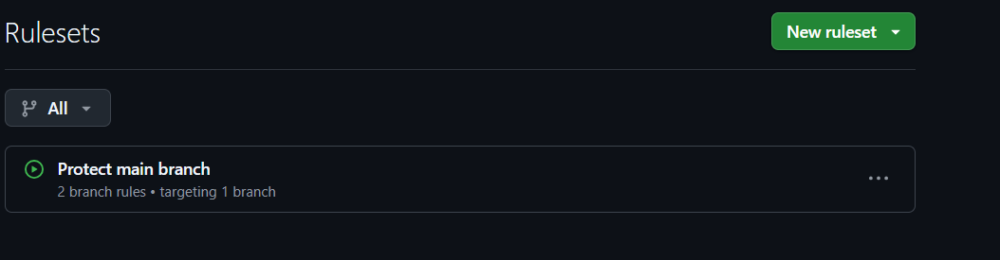
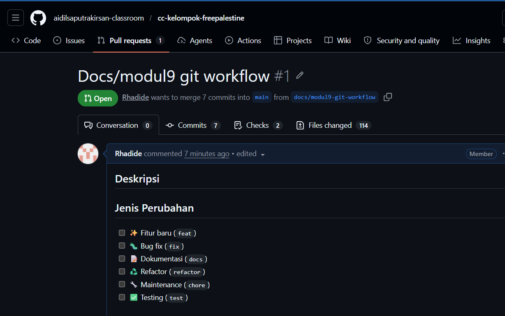
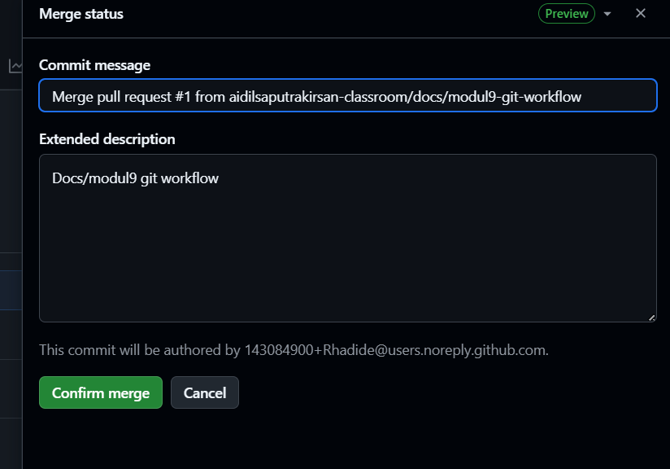
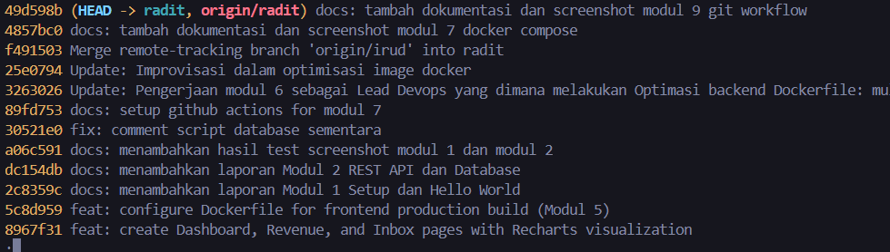

# Modul 9: Git Workflow & Branching Strategy

## 📌 Tujuan
Modul ini mendokumentasikan penerapan **Git Workflow** secara profesional pada repository tim. Fokus bergeser dari sekadar *push ke main* menjadi pengelolaan kode dengan sistem **branch, Pull Request, dan code review** yang terstruktur untuk menjaga stabilitas branch `main`.

---

## 🌿 Strategi Branching yang Digunakan: GitHub Flow

Tim mengadopsi model **GitHub Flow** karena sederhana dan cocok untuk tim 5 orang. Aturan utamanya:

| Aturan | Detail |
|--------|--------|
| `main` selalu stabil | Tidak ada push langsung ke `main` |
| Mulai dari branch baru | Setiap fitur/fix dikerjakan di branch terpisah |
| Buat Pull Request | Semua perubahan masuk lewat PR |
| Review sebelum merge | Minimal 1 anggota harus approve PR |
| Hapus branch setelah merge | Agar repository tetap bersih |

### Konvensi Nama Branch

```
feature/nama-fitur     → Fitur baru
fix/nama-bug           → Perbaikan bug  
docs/nama-dokumen      → Update dokumentasi
chore/nama-maintenance → Konfigurasi / maintenance
refactor/nama-refactor → Perbaikan struktur kode
```

---

## 🛡️ Branch Protection Rules

Branch `main` dikonfigurasi dengan aturan perlindungan di GitHub Settings → Branches:

| Rule | Status |
|------|--------|
| Require a pull request before merging | ✅ Aktif |
| Required approvals: 1 reviewer | ✅ Aktif |
| Block force pushes | ✅ Aktif |

Bukti bahwa branch protection berhasil diterapkan (push langsung ke `main` ditolak):

| GitHub Branch Protection Settings |
| :---: |
|  |

---

## 📋 Pull Request Workflow

Setiap perubahan kode mengikuti alur berikut:

```
1. git checkout main && git pull origin main
2. git checkout -b feature/nama-fitur
3. [Kerjakan fitur]
4. git add . && git commit -m "feat: deskripsi"
5. git push origin feature/nama-fitur
6. Buka GitHub → Compare & pull request
7. Isi deskripsi PR, assign reviewer
8. Reviewer melakukan code review & approve
9. Squash and merge ke main
10. Delete branch
```

---

## 👥 CODEOWNERS

File `.github/CODEOWNERS` dikonfigurasi untuk menentukan reviewer otomatis per area kode:

| Area Kode | Reviewer Otomatis |
|-----------|------------------|
| `/backend/` | Lead Backend (Ariel) |
| `/frontend/` | Lead Frontend (Ariel) |
| `docker-compose.yml`, `Dockerfile` | Lead DevOps (Irud) |
| `/docs/`, `README.md` | Lead QA & Docs (Radit) |
| `/.github/workflows/` | Lead CI/CD |

---

## 🔄 Bukti Pull Request & Code Review

### PR yang Berhasil Dibuat dan Di-merge

| Daftar Pull Request di GitHub (Closed/Merged) |
| :---: |
|  |

### Detail Salah Satu PR (Termasuk Review)

| Tampilan PR dengan Review Comments & Approval |
| :---: |
|  |

### Bukti Squash & Merge Berhasil

| Konfirmasi Squash and Merge |
| :---: |
|  |

---

## 📊 Git Log — Riwayat Commit

Riwayat commit branch `main` setelah menerapkan Git Workflow menunjukkan commit yang bersih dan terstruktur dengan format Conventional Commits.

| Output `git log --oneline` di Branch Main |
| :---: |
|  |

---

## ✅ Checklist Modul 9

- [x] Branch protection aktif di `main`
- [x] File `.github/CODEOWNERS` terkonfigurasi
- [x] Setiap anggota membuat feature branch
- [x] PR dibuat dan melalui proses code review
- [x] Minimal 1 PR berhasil di-review dan di-merge via Squash & Merge
- [x] Branch di-delete setelah merge
