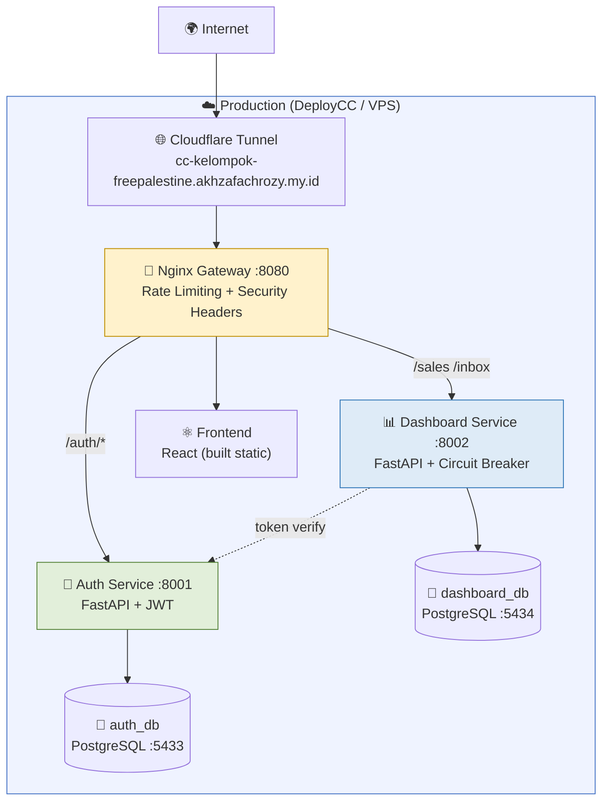
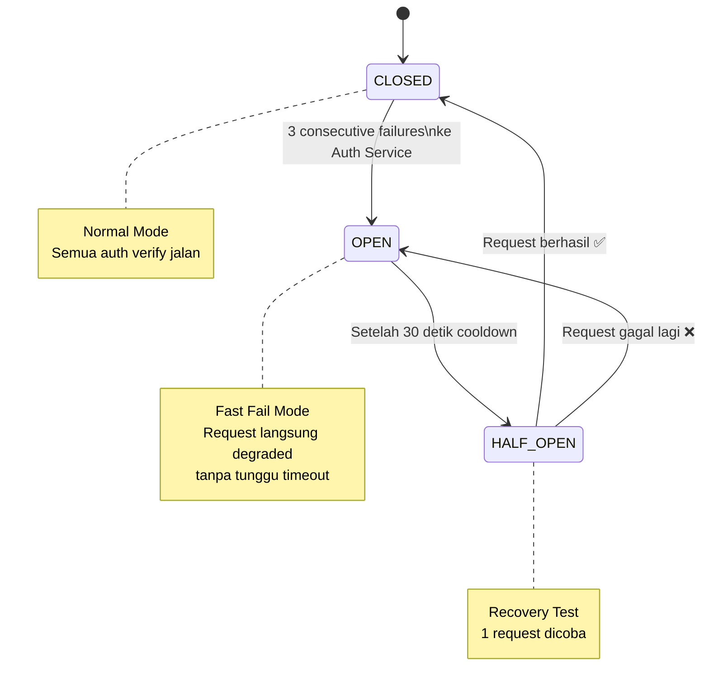
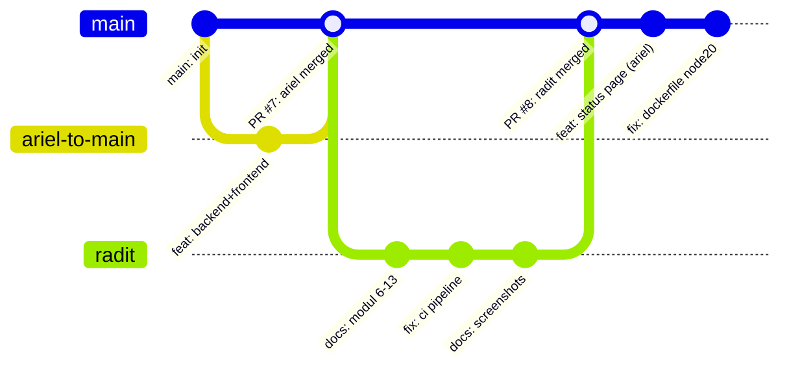

# Operations Guide — Dashboard Revenue Telkom Regional 4 Kalimantan

**Disusun oleh:** Raditya Yudianto (10231076) — Lead QA & Docs  
**Tanggal:** 24 Mei 2026  
**Versi:** 3.0.0

---

## 1. Cara Menjalankan Aplikasi

### Mode Monolith (Sederhana)

```bash
# Start semua service
docker compose up -d

# Cek status
docker compose ps

# Stop semua
docker compose down
```

### Mode Microservices

```bash
# Start microservices
docker compose -f docker-compose.microservices.yml up -d

# Cek health semua service
curl http://localhost:8080/health          # Gateway
curl http://localhost:8080/health/auth     # Auth Service
curl http://localhost:8080/health/dashboard  # Dashboard Service
```

---

## 2. Arsitektur Deployment



---

## 3. Monitoring & Health Check

### Endpoint Health Check

| URL | Cek Apa | Response Normal |
|-----|---------|-----------------|
| `/health` | Gateway OK | `{"status":"healthy","service":"gateway"}` |
| `/health/auth` | Auth Service OK | `{"status":"healthy","service":"auth-service"}` |
| `/health/dashboard` | Dashboard + Circuit Breaker | `{"status":"healthy","circuit_breaker":{"state":"closed"}}` |

### Metrics Endpoint

| URL | Data |
|-----|------|
| `/metrics/auth` | Request count, error count Auth Service |
| `/metrics/dashboard` | Request count, error count, CB state Dashboard Service |

### System Status Page (Frontend)

Buka browser → Login → klik **"System Status"** di sidebar

```
Auto-refresh setiap 10 detik
Menampilkan: status tiap service + circuit breaker state + metrics
```

---

## 4. Circuit Breaker — Dashboard Service



**Saat Circuit OPEN (degraded mode):**
- Auth verify dilewati
- User ID = 0, role = "viewer"
- Response tetap diberikan (tidak error 500)
- Log akan mencatat: `"Circuit OPEN — using degraded mode"`

---

## 5. Troubleshooting Umum

### Backend tidak bisa connect ke database

```bash
# Cek container database
docker compose ps | grep db

# Cek log database
docker compose logs auth-db --tail=20
docker compose logs dashboard-db --tail=20

# Restart database
docker compose restart auth-db dashboard-db
```

### CI Pipeline gagal di GitHub Actions

| Error | Penyebab | Solusi |
|-------|----------|--------|
| `ImportError: cannot import name 'AuditLog'` | models.py lama | `git checkout origin/main -- backend/models.py` |
| `assert 0 >= 1` di test | Database kosong | Sudah fix: assertion jadi `"items" in data` |
| Frontend build fail | Node version lama | Dockerfile sudah pakai `node:20-alpine` |

### Auth Service tidak bisa diakses

```bash
# Cek log auth service
docker compose logs auth-service --tail=30

# Restart auth service
docker compose restart auth-service

# Cek circuit breaker state
curl http://localhost:8080/health/dashboard
# Lihat "circuit_breaker.state" — jika "open", tunggu 30 detik
```

### Rate Limit 429

```bash
# Kalau dapat HTTP 429 saat login:
# Tunggu 1 menit (auth_limit = 10r/menit)

# Kalau API biasa kena 429:
# Kurangi frekuensi request (limit = 30r/detik)
```

### Error 422 (Unprocessable Entity) - Validasi Input Gagal
Backend menerapkan pembatasan string input (`max_length`) untuk mencegah serangan Denial of Service (DoS):
- **Auth (Register/Login):** Password harus berkisar antara 8 hingga 128 karakter.
- **Revenue/Sales:** Nama `witel`, `channel`, dan `product` dibatasi maksimal 50 karakter.
- **Customer Care (Inbox/Ticket):** Judul tiket (`title`) maksimal 200 karakter, dan deskripsi (`description`) maksimal 2000 karakter.
- **Solusi:** Jika mendapati error 422, pastikan payload JSON yang dikirimkan oleh browser/client memenuhi batas panjang karakter di atas.

### Console Logs Kosong di Production
Seluruh log konsol frontend (`console.log` / `console.error`) dibatasi hanya aktif di lingkungan lokal development (`import.meta.env.DEV`) untuk mencegah fingerprinting API endpoint dan data leaks.
- **Untuk Keperluan Debugging:** Jalankan frontend secara lokal (`npm run dev`) agar log konsol dan stack trace internal kembali muncul di Developer Tools.

---

## 6. Cara Login & Penggunaan

1. Buka: `https://cc-kelompok-freepalestine.akhzafachrozy.my.id`
2. Klik **"Login"** → masukkan email dan password
3. Setelah login, akan diarahkan ke **Dashboard**
4. Fitur yang tersedia:
   - 📊 **Dashboard** — ringkasan revenue dan KPI
   - 📈 **Revenue** — data penjualan per witel
   - 📥 **Inbox** — notifikasi dan tugas
   - 🏆 **Leaderboard** — ranking performa
   - 📡 **System Status** — monitoring health service

---

## 7. Git Workflow Tim



---

*Operations Guide oleh Raditya Yudianto (10231076) — Lead QA & Docs*
