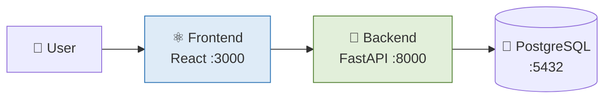

# Release Notes — Milestone 1 (UTS)

**Versi:** 1.0.0  
**Tanggal UTS:** Maret 2026  
**Tag:** `v1.0.0`  
**Disusun oleh:** Raditya Yudianto (10231076) — Lead QA & Docs

---

## Ringkasan Milestone 1

Milestone 1 adalah fase fondasi proyek. Dimulai dari setup lingkungan development, membangun REST API monolith, integrasi frontend React, hingga containerisasi dengan Docker. Semua pekerjaan Modul 1–8 masuk ke milestone ini.

---

## ✨ Fitur yang Dibangun

### 🚀 Modul 1 — Setup & Hello World
- Setup environment: Python, Node.js, PostgreSQL, Git
- Hello World FastAPI: endpoint `GET /` dan `GET /team`
- Repository GitHub dibuat dan dihubungkan

### 🗄️ Modul 2 — REST API & Database
- PostgreSQL terintegrasi via SQLAlchemy ORM
- CRUD endpoints: `POST /items`, `GET /items`, `PUT /items/{id}`, `DELETE /items/{id}`
- Swagger UI otomatis tersedia di `/docs`
- Database schema: tabel `users`, `sales_data`, `inbox_items`

### ⚛️ Modul 3 — Frontend React
- React + Vite project setup
- Dashboard UI: tampilan revenue, chart bar/line/donut
- Komponen: Header, Sidebar, ChartCard, Layout
- Axios integration dengan backend API

### 🔐 Modul 4 — Auth & CORS
- JWT authentication (login → token → akses protected endpoints)
- Password hashing dengan bcrypt
- CORS dikonfigurasi untuk izinkan frontend
- Middleware auth di semua endpoint protected

### 🐳 Modul 5-6 — Docker & Docker Compose
- Dockerfile untuk backend (Python) dan frontend (Node + Nginx)
- `docker-compose.yml` menjalankan 3 containers:
  - `backend`: FastAPI app
  - `frontend`: React built + Nginx
  - `db`: PostgreSQL

### 🔄 Modul 7 — CI Pipeline Awal
- GitHub Actions workflow pertama
- Job: install dependencies, run tests, build Docker image
- Push ke main → trigger CI otomatis

### 🎓 Modul 8 — UTS Demo (Milestone 1)
- Live demo aplikasi end-to-end
- Register → Login → Dashboard → CRUD data
- Presentasi arsitektur monolith

---

## 📊 Statistik Milestone 1

| Metrik | Nilai |
|--------|-------|
| Total Endpoints | 15+ |
| Docker Services | 3 (backend, frontend, db) |
| React Components | 10+ |
| Backend Tests | Basic health check |
| Total Commits | 30+ |

---

## 🏗️ Arsitektur Milestone 1 (Monolith)

---

## 👥 Kontribusi Tim Milestone 1

| Nama | NIM | Peran | Kontribusi |
|------|-----|-------|------------|
| Ariel Itsbat Nurhaq | 10231009 | Lead Backend & Frontend | FastAPI endpoints, React UI, Auth, database schema |
| Muhammad Khoiruddin Marzuq | 10231056 | Lead DevOps | Docker setup, docker-compose, CI workflow awal |
| Raditya Yudianto | 10231076 | Lead QA & Docs | Dokumentasi setup, testing API endpoints, member docs |

---

*Release notes disusun oleh Raditya Yudianto (10231076)*
