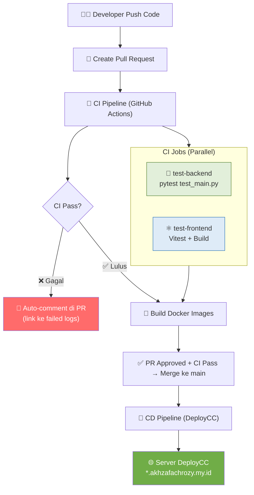

# Release Notes — Milestone 2 (v2.0.0)

**Versi:** 2.0.0  
**Tanggal Rilis:** 17 Mei 2026  
**Lead QA & Docs:** Raditya Yudianto (10231076)  
**Status:** ✅ Stable Release

---

## Ringkasan

Milestone 2 menandai penyelesaian fase **CI/CD & Deployment** (Modul 9-11) dan transisi ke fase **Microservices** (Modul 12-13). Aplikasi Dashboard Telkom Regional 4 Kalimantan kini memiliki pipeline CI/CD penuh, testing otomatis, dan arsitektur microservices yang berjalan di server DeployCC (platform deployment khusus mata kuliah CC).

---

## Fitur Baru di v2.0.0

### 🔄 CI/CD Pipeline (Modul 10-11)

| Fitur | Deskripsi |
|-------|-----------|
| **GitHub Actions CI** | 4-job pipeline: test backend, test frontend, build Docker, notify PR |
| **Automated Testing** | 11 backend tests (pytest) + 16 frontend tests (Vitest) berjalan otomatis |
| **Docker Build Verification** | Image backend dan frontend di-build ulang setiap push |
| **PR Auto-Comment** | Pipeline otomatis komentar di PR jika CI gagal |
| **CD Pipeline (DeployCC)** | Auto-deploy ke server DeployCC setelah CI hijau di main |
| **Cloudflare Tunnel** | Aplikasi dapat diakses via domain publik `*.akhzafachrozy.my.id` |

### 🔐 Branch Protection & Git Workflow (Modul 9)

| Fitur | Deskripsi |
|-------|-----------|
| **CODEOWNERS** | Auto-review assignment berdasarkan path file |
| **PR Template** | Template PR standar dengan checklist wajib |
| **Branch Protection** | Require PR + CI pass sebelum merge ke main |
| **CHANGELOG** | Riwayat perubahan terstruktur |

### 🏗️ Arsitektur Microservices (Modul 12-13)

| Service | Port | Database |
|---------|------|----------|
| **Auth Service** | 8001 | `auth_db` |
| **Dashboard Service** | 8002 | `dashboard_db` |
| **API Gateway (Nginx)** | 8080 | — |
| **Frontend (React)** | 3000 | — |

### 📊 Fitur Frontend Baru

| Halaman | Deskripsi |
|---------|-----------|
| **Witel Leaderboard** | Ranking Witel berdasarkan revenue dengan toggle tampilan |
| **Customer Care** | Manajemen tiket customer care |
| **Upload CSV** | Import data revenue dan customer care via file CSV/XLSX |
| **Users Management** | Manajemen user (khusus admin) |
| **About Page** | Informasi tim dan tech stack |
| **Error Boundary** | Graceful error handling dengan pesan user-friendly |

### 🔧 Backend Improvements

| Fitur | Deskripsi |
|-------|-----------|
| **Structured Logging** | JSON logging dengan correlation ID (Modul 14) |
| **Metrics Endpoint** | `/metrics` untuk monitoring requests dan latency |
| **Config Module** | `backend/config.py` untuk konfigurasi berbasis environment |
| **Health Check Enhanced** | Database connectivity check di `/health` |
| **Category Filter** | Filter inbox berdasarkan kategori |
| **CSV/XLSX Upload** | Endpoint upload data bulk |

---

## Production Environment

Aplikasi di-deploy ke server **DeployCC** (platform khusus mata kuliah):

| Komponen | URL |
|----------|-----|
| **Frontend** | `https://cc-kelompok-freepalestine.akhzafachrozy.my.id` |
| **Backend API** | `https://cc-kelompok-freepalestine.akhzafachrozy.my.id/api` |
| **API Docs** | `https://cc-kelompok-freepalestine.akhzafachrozy.my.id/api/docs` |
| **Health Check** | `https://cc-kelompok-freepalestine.akhzafachrozy.my.id/api/health` |

### Teknologi Deployment

| Komponen | Teknologi |
|----------|-----------|
| **Server** | Linux server dengan systemctl service management |
| **Tunnel** | Cloudflare Tunnel (cloudflared) |
| **Web Server** | Uvicorn (ASGI) |
| **Process Manager** | systemd service (`deploycc-*.service`) |
| **Database** | PostgreSQL via `dbtool` |

---

## Alur CI/CD Pipeline

---

## Perubahan Breaking

| Area | Perubahan | Migrasi |
|------|-----------|---------|
| **Docker Compose** | Ditambahkan `docker-compose.microservices.yml` untuk arsitektur microservices | Gunakan `docker compose up -d` untuk monolith, atau `-f docker-compose.microservices.yml` untuk microservices |
| **Frontend API URL** | Konfigurasi melalui `VITE_API_URL` env var | Update `.env.production` |

---

## Known Issues

| Issue | Status | Workaround |
|-------|--------|------------|
| Frontend blank saat pertama load | Ditangani dengan `ErrorBoundary` | Hard refresh (Ctrl+Shift+R) |
| CORS error dari domain baru | Update `ALLOWED_ORIGINS` | Edit `backend/.env` di server |
| Database timeout saat load tinggi | Implemented connection pool | Monitor via `/metrics` |

---

## Kontribusi Tim

| Anggota | Modul | Kontribusi Utama |
|---------|-------|-----------------|
| **Ariel Itsbat Nurhaq** (10231018) | 1-15 | Lead Backend: API, Auth, Upload, Microservices. Lead Frontend: React pages, routing, components |
| **Muhammad Khoiruddin Marzuq** (10231065) | 5, 6, 7, 9 | Lead DevOps: Docker, Docker Compose, CI/CD workflow, Makefile, branch protection |
| **Raditya Yudianto** (10231076) | 1-11 | Lead QA & Docs: Testing, dokumentasi, laporan modul, review PR |

---

## Statistik Repository

| Metrik | Nilai |
|--------|-------|
| Total commits di main | 30+ commits |
| Files changed | 84 files |
| Lines added | 8,347+ |
| Backend tests | 11 tests |
| Frontend tests | 16 tests |
| GitHub Actions workflows | 2 (CI + CD) |

---

## Roadmap Selanjutnya (Milestone 3)

- [x] Microservices decomposition (Auth Service + Dashboard Service)
- [x] Circuit Breaker pattern
- [x] Retry dengan Exponential Backoff
- [ ] Structured Logging & Tracing (Modul 14)
- [ ] Rate Limiting & Security Headers (Modul 15)
- [ ] Final Documentation & Presentation (Modul 16)

---

*Release notes dibuat oleh Raditya Yudianto (10231076) — Lead QA & Docs*  
*Dashboard Telkom Regional 4 Kalimantan — Tim Free Palestine*
