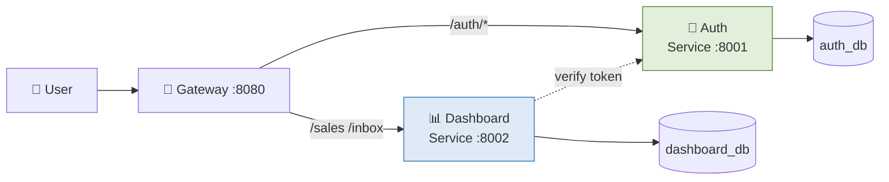

# Release Notes — Milestone 3 (Final UAS)

**Versi:** 3.0.0  
**Tanggal:** 24 Mei 2026  
**Tag:** `v3.0.0`  
**Disusun oleh:** Raditya Yudianto (10231076) — Lead QA & Docs

---

## Ringkasan Milestone 3

Milestone 3 adalah fase akhir proyek Cloud Computing yang mengubah aplikasi dari **monolith** menjadi **microservices** dengan tambahan observability dan security hardening. Semua fitur baru dikerjakan pada Modul 12–15.

---

## ✨ Fitur Baru (dari Milestone 2)

### 🏗️ Arsitektur Microservices (Modul 12)

- **Auth Service** (port 8001) — FastAPI mandiri dengan database `auth_db` sendiri
- **Dashboard Service** (port 8002) — FastAPI mandiri dengan database `dashboard_db` sendiri  
- **API Gateway** — Nginx sebagai reverse proxy, routing semua request
- **Database per service** — tidak ada shared database antar service
- Inter-service communication via HTTP REST (`/auth/verify`)



### ⚡ Reliability Patterns (Modul 13)

- **Retry dengan Exponential Backoff** — 3 percobaan dengan delay 0.5s → 1s → 2s
- **Circuit Breaker** — threshold 3 failures, cooldown 30 detik
  - State machine: `CLOSED` → `OPEN` → `HALF_OPEN` → `CLOSED`
- **Graceful Degradation** — saat Auth Service down, Dashboard tetap bisa respon (degraded mode)
- **Health Check endpoint** — `/health` melaporkan status + circuit breaker state

### 📊 Monitoring & Observability (Modul 14)

- **Structured JSON Logging** — setiap log entry memiliki timestamp, level, service name, module
- **Correlation ID** — diteruskan via `X-Correlation-ID` header untuk request tracing lintas service
- **Metrics endpoint** — `/metrics` per service (request count, error count)
- **System Status Page** — frontend React dengan auto-refresh 10 detik, tampilkan status semua service

### 🛡️ Security Hardening (Modul 15)

- **Rate Limiting di Gateway** — login: 10r/menit, API umum: 30r/detik
- **Security Headers** — X-Content-Type-Options, X-Frame-Options, X-XSS-Protection, CSP
- **Body Size Limit** — max 10MB per request
- **Brute Force Protection** — rate limit ketat di `/auth/login`
- **Input Size Restrictions (FastAPI)** — added strict length checks (`max_length` up to 50/100/2000 chars) for Pydantic input schemas (witel, channel, product, and descriptions) to block oversized payloads.
- **Production Log Silencing (Frontend)** — restricted browser console logging (errors and info) using environment-based gates (`import.meta.env.DEV`) to prevent fingerprinting and sensitive API endpoint disclosure in production.

---

## 📊 Statistik Proyek

| Metrik | Nilai |
|--------|-------|
| Total Services (Docker) | 5 (auth-service, dashboard-service, gateway, auth-db, dashboard-db) |
| Total API Endpoints | 18+ |
| Microservices | 2 (Auth + Dashboard) |
| CI/CD Jobs | 4 (Test Backend, Test Frontend, Build Docker, Notify) |
| Backend Test Coverage | 56% |
| Backend Tests Passing | 19/19 |
| Total Commits (all branches) | 80+ |
| Total PRs Merged | 14+ |

---

## 🔄 Perubahan Breaking dari v2.0.0

| Perubahan | Dampak |
|-----------|--------|
| URL `/health/auth` dan `/health/dashboard` ditambah | Status page baru |
| URL `/metrics/auth` dan `/metrics/dashboard` ditambah | Monitoring endpoint |
| Database dipisah menjadi 2 | Tidak ada backward compatibility dengan monolith DB |

---

## 🐛 Known Issues

| Issue | Severity | Status |
|-------|----------|--------|
| Metrics endpoint masih in-memory (reset saat restart) | Low | Acceptable untuk scope akademik |
| StatusPage tidak bisa akses microservices jika deploy tanpa docker-compose | Medium | Monolith backend tetap bisa diakses |

---

## 👥 Kontribusi Tim Milestone 3

| Nama | NIM | Peran | Kontribusi Modul 12-15 |
|------|-----|-------|------------------------|
| Ariel Itsbat Nurhaq | 10231009 | Lead Backend & Frontend | Auth Service, Dashboard Service, StatusPage, Dockerfile hardening |
| Muhammad Khoiruddin Marzuq | 10231056 | Lead DevOps | API Gateway Nginx, Docker Compose, CI/CD pipeline, deployment |
| Raditya Yudianto | 10231076 | Lead QA & Docs | Dokumentasi Modul 10-15, CI pipeline fix, test assertion fix, security audit report |

---

## 📌 Cara Menjalankan v3.0.0

```bash
# Clone dan setup
git clone https://github.com/aidilsaputrakirsan-classroom/cc-kelompok-freepalestine.git
cd cc-kelompok-freepalestine

# Copy env (isi sesuai kebutuhan)
cp backend/.env.example backend/.env

# Jalankan microservices
docker compose -f docker-compose.microservices.yml up -d

# Atau jalankan monolith (lebih sederhana)
docker compose up -d

# Verifikasi
curl http://localhost:8080/health
curl http://localhost:8080/health/auth
curl http://localhost:8080/health/dashboard
```

---

## 🔗 Link Penting

- **Production URL:** `https://cc-kelompok-freepalestine.akhzafachrozy.my.id`
- **GitHub Actions:** [CI/CD Pipeline](https://github.com/aidilsaputrakirsan-classroom/cc-kelompok-freepalestine/actions)
- **PR History:** [All Merged PRs](https://github.com/aidilsaputrakirsan-classroom/cc-kelompok-freepalestine/pulls?q=is%3Amerged)

---

*Release notes disusun oleh Raditya Yudianto (10231076)*
