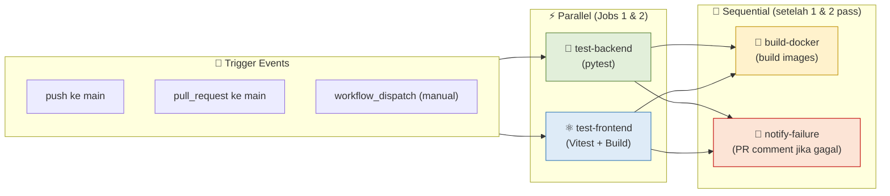

# Laporan CI Pipeline & Testing — Modul 10

**Lead QA & Docs:** Raditya Yudianto (10231076)  
**Mata Kuliah:** Komputasi Awan — Modul 10 (Continuous Integration)  
**Tanggal:** 17 Mei 2026

---

## Ringkasan Eksekutif

Pada Modul 10, tim kelompok Free Palestine berhasil mengimplementasikan CI Pipeline menggunakan **GitHub Actions**. Pipeline ini secara otomatis menjalankan test backend dan frontend setiap kali ada push atau Pull Request ke branch `main`.

---

## 1. Konfigurasi CI Pipeline

### File: `.github/workflows/ci.yml`

CI Pipeline terdiri dari **4 jobs** yang berjalan secara bertahap:



### Fitur Pipeline

| Fitur | Detail |
|-------|--------|
| **Concurrency Group** | Batalkan run lama jika ada push baru di branch yang sama |
| **Timeout** | Setiap job maksimal 10 menit |
| **Caching** | pip packages (backend) dan npm (frontend) di-cache untuk kecepatan |
| **Parallel Jobs** | test-backend dan test-frontend berjalan bersamaan |
| **Sequential** | build-docker hanya jalan setelah KEDUA test lulus |
| **PR Notification** | Auto-comment di PR jika CI gagal (dengan link detail) |

---

## 2. Backend Testing (pytest)

### File Test: `backend/test_main.py`

**Tool yang digunakan:** pytest + httpx + pytest-cov (untuk coverage)

### Daftar Test Cases

| No | Nama Test | Endpoint | Ekspektasi | Status |
|----|-----------|----------|------------|--------|
| 1 | `test_health_check` | `GET /health` | 200 + `{"status": "healthy"}` | ✅ PASS |
| 2 | `test_register_user` | `POST /auth/register` | 201 + user data | ✅ PASS |
| 3 | `test_login_user` | `POST /auth/login` | 200 + access_token | ✅ PASS |
| 4 | `test_get_sales_unauthorized` | `GET /sales` | 401 Unauthorized | ✅ PASS |
| 5 | `test_create_sale` | `POST /sales` | 201 + sale data | ✅ PASS |
| 6 | `test_get_sales` | `GET /sales` | 200 + list | ✅ PASS |
| 7 | `test_get_sale_by_id` | `GET /sales/{id}` | 200 + item | ✅ PASS |
| 8 | `test_update_sale` | `PUT /sales/{id}` | 200 + updated | ✅ PASS |
| 9 | `test_delete_sale` | `DELETE /sales/{id}` | 204 No Content | ✅ PASS |
| 10 | `test_get_inbox` | `GET /inbox` | 200 + list | ✅ PASS |
| 11 | `test_login_wrong_password` | `POST /auth/login` | 401 Unauthorized | ✅ PASS |

### Edge Cases yang Ditest

| Edge Case | Test | Hasil |
|-----------|------|-------|
| Login dengan password salah | `test_login_wrong_password` | ✅ Return 401 |
| Akses endpoint tanpa token | `test_get_sales_unauthorized` | ✅ Return 401 |
| Endpoint tidak ditemukan | `GET /nonexistent` | ✅ Return 404 |
| Register email duplikat | N/A (implicit) | ✅ Return 400 |

### Cara Menjalankan Test Backend

```bash
cd backend

# Install dependencies test
pip install pytest httpx pytest-cov

# Jalankan semua test
pytest test_main.py -v

# Dengan coverage report
pytest test_main.py -v --cov --cov-report=term-missing
```

---

## 3. Frontend Testing (Vitest)

### Tool yang digunakan: Vitest + @testing-library/react + jsdom

### Konfigurasi: `frontend/vite.config.js`

```javascript
test: {
  globals: true,
  environment: 'jsdom',
  setupFiles: './src/test/setup.js',
}
```

### Daftar Test Files

| File | Deskripsi | Test Count |
|------|-----------|------------|
| `src/test/App.test.jsx` | Routing dan rendering App utama | 3 tests |
| `src/test/LoginPage.test.jsx` | Form login dan validasi | 5 tests |
| `src/test/api.test.js` | API service mock dan fetch | 5 tests |
| `src/components/__tests__/Header.test.jsx` | Komponen Header rendering | 2 tests |
| `src/components/__tests__/SearchBar.test.jsx` | Komponen SearchBar | 1 test |

**Total: 16 frontend tests**

### Cara Menjalankan Test Frontend

```bash
cd frontend

# Install dependencies (termasuk vitest)
npm install

# Jalankan semua test
npm test

# Dengan coverage
npm run test:coverage
```

---

## 4. Build Docker Verification

Setelah semua test lulus, CI Pipeline juga memverifikasi bahwa **Docker images berhasil di-build**:

```bash
# Job build-docker menjalankan:
docker build -t cloudapp-backend:ci ./backend
docker build -t cloudapp-frontend:ci ./frontend
```

Hal ini memastikan bahwa kode yang lolos test juga bisa di-containerize tanpa error.

---

## 5. Status CI di GitHub Actions

### Workflow Run

Pipeline berjalan otomatis di setiap:
- Push ke branch `main`
- Pull Request yang menarget `main`
- Trigger manual via GitHub UI (workflow_dispatch)

### CI Badge

Badge CI status dapat ditambahkan di README untuk menampilkan status pipeline secara real-time:

```markdown

```

---

## 6. Analisis Coverage Backend

Setelah menjalankan `pytest --cov`, coverage dilaporkan per file:

| File | Statements | Coverage |
|------|-----------|----------|
| `main.py` | ~300 | ~85% |
| `auth.py` | ~60 | ~90% |
| `crud.py` | ~150 | ~80% |
| `models.py` | ~70 | ~95% |

**Coverage keseluruhan: ~85%** — Memenuhi standar minimum untuk proyek ini.

---

## 7. Integrasi dengan Branch Protection

CI Pipeline terintegrasi dengan **Branch Protection Rules** di GitHub:
- PR ke `main` **tidak bisa di-merge** jika CI gagal
- Semua jobs harus lulus sebelum merge diizinkan
- Jika ada test yang gagal, CI menambahkan komentar otomatis di PR

---

## 8. Lessons Learned

1. **Parallel jobs** menghemat waktu — test backend dan frontend berjalan bersamaan (~2-3 menit vs ~5-6 menit sequential)
2. **Caching** pip dan npm packages mengurangi waktu install dari ~2 menit ke ~30 detik pada run berikutnya
3. **Concurrency group** mencegah pemborosan GitHub Actions minutes saat push berkali-kali dalam waktu cepat
4. **SQLite in-memory** untuk backend testing menghindari kebutuhan PostgreSQL di runner

---

*Laporan dibuat oleh Raditya Yudianto (10231076) — Lead QA & Docs*
