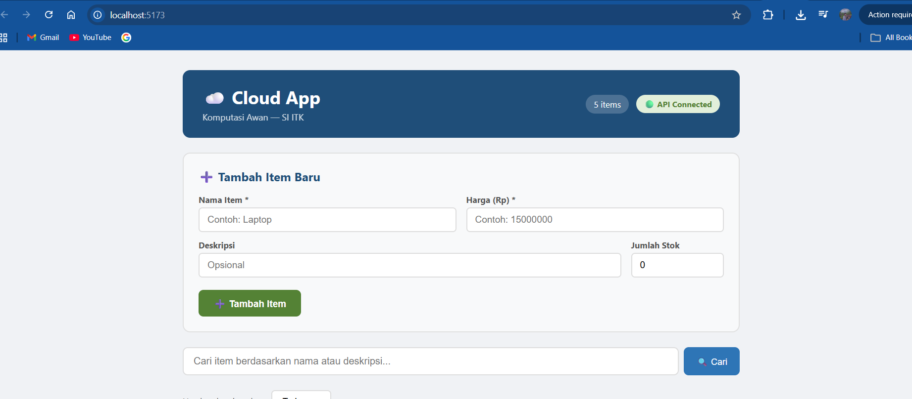
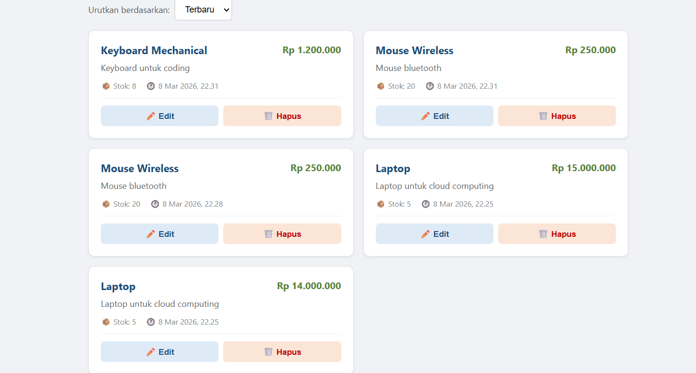
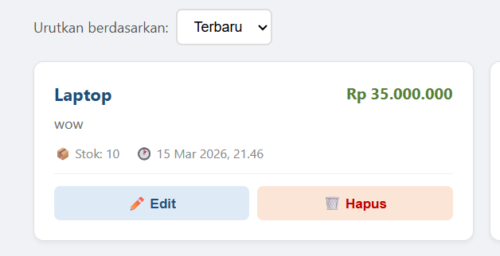
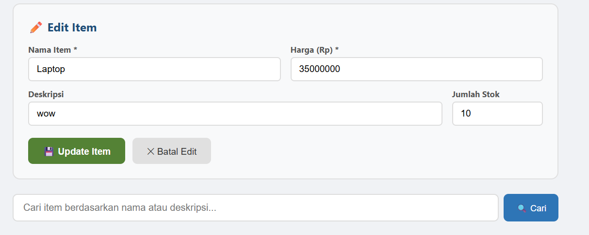
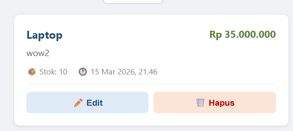
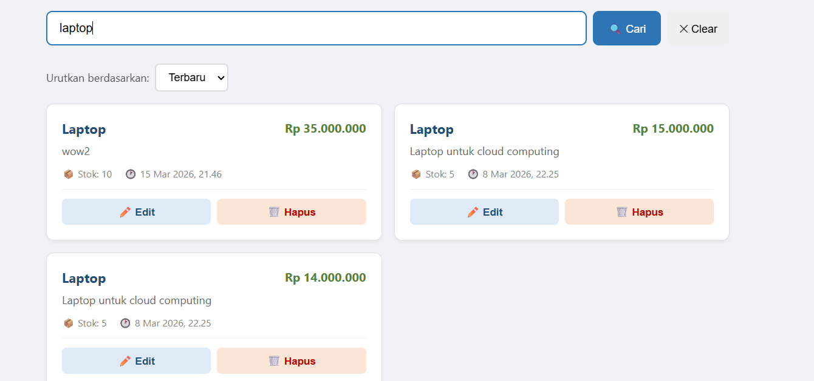
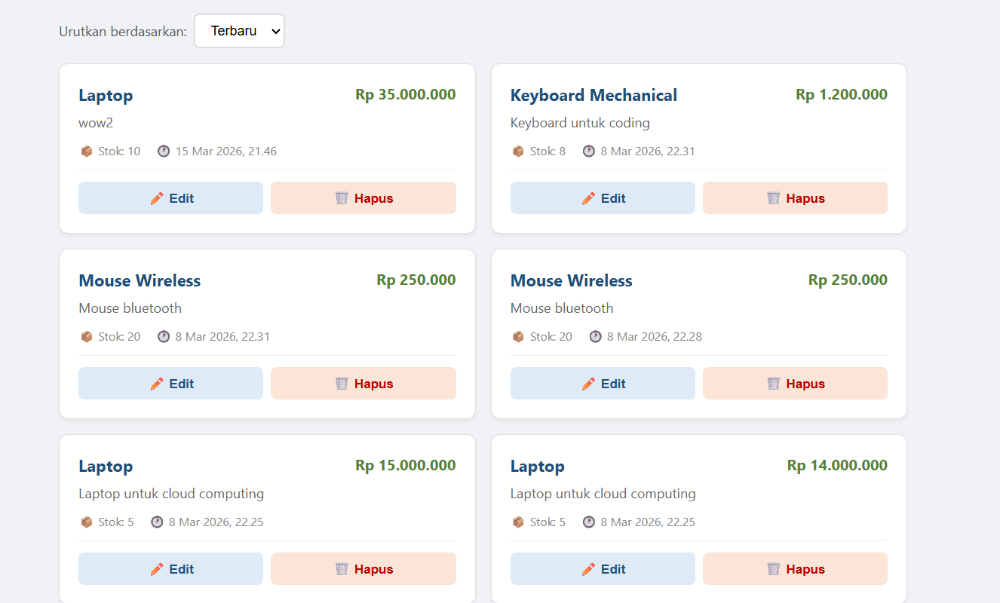
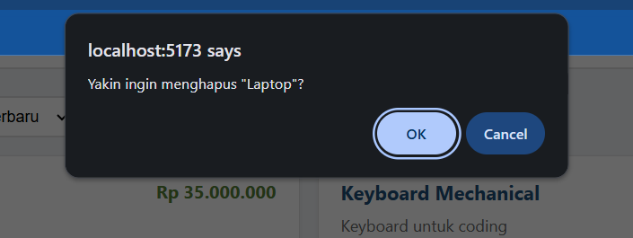
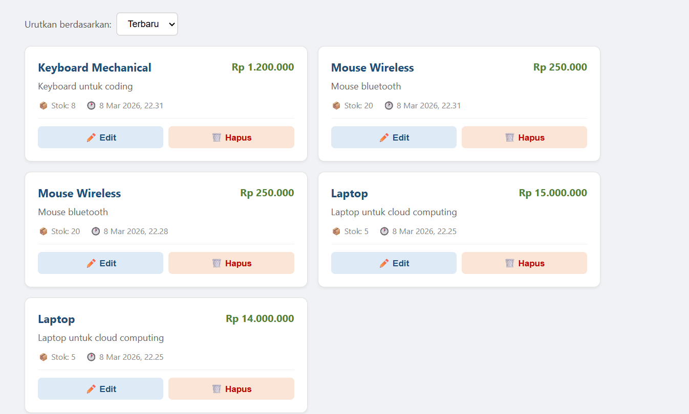

# 📋 UI Test Results — Modul 3

**Tester:** Raditya Yudianto (Lead QA & Docs)  
**Tanggal:** 12 Maret 2026  
**URL:** http://localhost:5173  
**Status Backend:** http://localhost:8000 ✅ Running

---

## Daftar Test Case

| # | Test Case | Steps | Expected | Actual | Status | Dokumentasi |
|---|-----------|-------|----------|--------|--------|-------------|
| 1 | Cek koneksi API | Buka localhost:5173 | Header menampilkan "🟢 API Connected" | Header menampilkan "🟢 API Connected" | ✅ Pass |  |
| 2 | Tampil daftar items | Lihat daftar di halaman utama | Items dari Modul 2 muncul sebagai cards | Items (Laptop, Mouse, Keyboard) muncul sebagai cards | ✅ Pass |  |
| 3 | Tambah item baru | Isi form: Nama=Monitor, Harga=3500000, klik Tambah | Item baru muncul di daftar | Item "Monitor" berhasil ditambahkan | ✅ Pass |  |
| 4 | Verifikasi item muncul | Cek card di grid | Card "Monitor" tampil dengan harga benar | Card "Monitor" tampil dengan harga Rp3.500.000 | ✅ Pass |  |
| 5 | Klik tombol Edit | Klik ✏️ Edit pada item | Form terisi data item yang dipilih | Form terisi otomatis dengan data item | ✅ Pass |  |
| 6 | Update item | Ubah harga, klik Update Item | Harga berubah di daftar | Harga item berhasil diperbarui | ✅ Pass |  |
| 7 | Fitur Search | Ketik "laptop" di SearchBar, klik Cari | Hanya item Laptop yang tampil | Hanya 1 item "Laptop" yang ditampilkan | ✅ Pass |  |
| 8 | Clear Search | Klik tombol Clear | Semua item muncul kembali | Semua item kembali ditampilkan | ✅ Pass |  |
| 9 | Konfirmasi Hapus | Klik 🗑️ Hapus pada item | Dialog konfirmasi muncul | Dialog "Yakin ingin menghapus?" muncul | ✅ Pass |  |
| 10 | Hapus item | Klik OK di dialog | Item hilang dari daftar | Item berhasil dihapus dari daftar | ✅ Pass |  |

---

## Hasil Keseluruhan

- **Total Test:** 10

